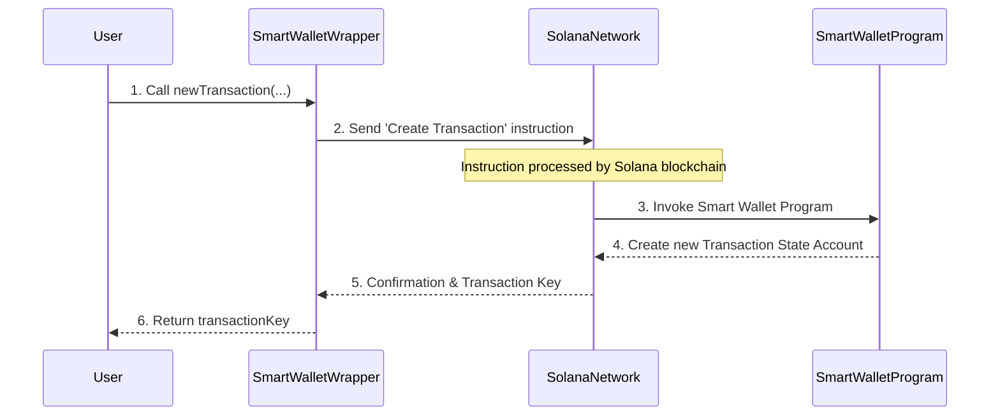

# Chapter 1: SmartWalletWrapper

Welcome to the world of Goki! In this first chapter, we're going to explore the `SmartWalletWrapper`. Think of it as your personal, easy-to-use remote control for managing special digital wallets on the Solana blockchain.

## What Problem Does it Solve?

Imagine you and a few friends want to share a digital bank account where everyone needs to agree before any money is spent. On the blockchain, this is called a "multi-signature" (or "multisig") wallet. It's a powerful tool for shared control and security, but directly interacting with it can be complex.

This is where the `SmartWalletWrapper` comes in! It simplifies all those complex steps into simple actions you can perform. It's designed to make managing your Goki Smart Wallets as straightforward as possible, no matter how many people are involved in the decisions.

Our main goal in this chapter is to understand how the `SmartWalletWrapper` helps you **create and manage shared transactions** on the blockchain.

## Your Remote Control for Smart Wallets

The `SmartWalletWrapper` is like an app on your smartphone that lets you control your smart home. You don't need to know the complex electrical wiring; you just tap a button. Similarly, with the `SmartWalletWrapper`, you don't need to write low-level blockchain code. You just use its convenient functions!

Once you "load" a specific Goki Smart Wallet into this wrapper, it gives you direct access to its core features.

Here are the main actions you can perform:

| Feature           | What it Does                                           |
| :---------------- | :----------------------------------------------------- |
| `newTransaction`  | Propose a new action (e.g., send SOL, change owners).  |
| `approveTransaction` | Add your "OK" to a proposed action.                 |
| `executeTransaction` | Finalize and run an action once enough approvals are met. |
| `reloadData`      | Get the latest information about your Smart Wallet.    |
| `fetchTransaction` | Get details about a specific proposed action.          |

Let's see how this works in practice with our shared digital bank account example.

## Using the SmartWalletWrapper: A Basic Example

Imagine we want to set up a shared Goki Smart Wallet where at least two people (out of three) must approve any transaction. Then, we'll propose and approve a transaction to send some SOL.

First, you need to get an instance of the `SmartWalletWrapper`. This usually happens when you create a new Smart Wallet or load an existing one using the main Goki SDK:

```typescript
import { Keypair, PublicKey, LAMPORTS_PER_SOL } from "@solana/web3.js";
import { makeSDK } from "./workspace"; // Helper to get the SDK
import BN from "bn.js";

const sdk = makeSDK(); // Our entry point to Goki
const ownerA = Keypair.generate();
const ownerB = Keypair.generate();
const ownerC = Keypair.generate();
const owners = [ownerA.publicKey, ownerB.publicKey, ownerC.publicKey];
const threshold = new BN(2); // Requires 2 approvals out of 3 owners

let smartWalletWrapper; // This will hold our remote control!

// Create a new Smart Wallet (and get its wrapper)
const { smartWalletWrapper: wrapperInner, tx } = await sdk.newSmartWallet({
  numOwners: owners.length,
  owners,
  threshold,
});
await tx.confirm(); // Send the transaction to create the wallet
smartWalletWrapper = wrapperInner;
console.log("Smart Wallet created:", smartWalletWrapper.key.toBase58());
```
*Explanation*: Here, we use `sdk.newSmartWallet` to create a new Goki Smart Wallet. This function not only creates the wallet on the blockchain but also *returns* the `smartWalletWrapper` instance, which is our remote control. We then confirm the transaction to make sure the wallet is actually created on Solana.

Now, let's say we want to send `0.1 SOL` from this shared wallet to a friend:

```typescript
import { SystemProgram } from "@solana/web3.js";
// ... (previous code for smartWalletWrapper)

const recipient = Keypair.generate().publicKey; // Our friend's address
const amountToSend = 0.1 * LAMPORTS_PER_SOL;

// 1. Propose a new transaction (Owner A proposes)
const transferInstruction = SystemProgram.transfer({
  fromPubkey: smartWalletWrapper.key, // From our Smart Wallet
  toPubkey: recipient,
  lamports: amountToSend,
});

const { transactionKey, tx: proposeTx } =
  await smartWalletWrapper.newTransaction({
    proposer: ownerA.publicKey,
    instructions: [transferInstruction],
  });
proposeTx.signers.push(ownerA); // Owner A signs the proposal transaction
await proposeTx.confirm();
console.log("Transaction proposed:", transactionKey.toBase58());
```
*Explanation*: We define a `transferInstruction` that describes sending SOL. Then, `smartWalletWrapper.newTransaction` is called by `ownerA` to create this pending transaction. This doesn't send the SOL yet; it just records the proposal. The `transactionKey` is like a unique ID for this proposed action.

Now, another owner needs to approve it. Since our threshold is 2, one more approval is enough:

```typescript
// ... (previous code for transactionKey)

// 2. Another owner approves the transaction (Owner B approves)
await smartWalletWrapper
  .approveTransaction(transactionKey, ownerB.publicKey)
  .addSigners(ownerB)
  .confirm();
console.log("Transaction approved by Owner B.");

// Check the current state of the transaction (optional)
const txState = await smartWalletWrapper.fetchTransaction(transactionKey);
console.log("Approvals needed:", txState.numApprovalsNeeded.toNumber());
console.log("Approvals received:", txState.numApprovals.toNumber());
```
*Explanation*: `smartWalletWrapper.approveTransaction` is called by `ownerB`. This updates the proposed transaction on the blockchain to show that `ownerB` has approved it. We also use `fetchTransaction` to see that the transaction now has 2 approvals, meeting our threshold.

Finally, we can execute the transaction:

```typescript
// ... (previous code for transactionKey)

// 3. Execute the transaction (Owner C executes, or any owner can)
await smartWalletWrapper
  .executeTransaction({
    transactionKey,
    owner: ownerC.publicKey,
  })
  .addSigners(ownerC)
  .confirm();
console.log("Transaction executed successfully!");
// At this point, 0.1 SOL has been sent to the recipient!
```
*Explanation*: `smartWalletWrapper.executeTransaction` is called. Since the approval threshold (2) has been met, the Smart Wallet will now actually perform the `transferInstruction` that was proposed earlier. The SOL is sent to the recipient!

## Under the Hood: How the SmartWalletWrapper Works

The `SmartWalletWrapper` is not the Smart Wallet itself. It's a helpful layer built on top of the actual [Smart Wallet Program](05_smart_wallet_program_.md) on the blockchain.

When you use a function like `newTransaction` on the `SmartWalletWrapper`, here's a simplified sequence of what happens:


*Explanation*:
1.  **User action**: You call a method like `newTransaction` on your `smartWalletWrapper` instance.
2.  **Wrapper builds instruction**: The `SmartWalletWrapper` then prepares a special message, called an "instruction," for the [Smart Wallet Program](05_smart_wallet_program_.md). This instruction tells the program what you want to do (e.g., "create a new pending transaction").
3.  **To the network**: This instruction is bundled into a Solana transaction and sent to the [Solana Network](https://solana.com/).
4.  **Program invoked**: The Solana Network processes this transaction and tells the [Smart Wallet Program](05_smart_wallet_program_.md) to execute the instruction.
5.  **Program acts**: The [Smart Wallet Program](05_smart_wallet_program_.md) updates the blockchain. For `newTransaction`, it creates a new "account" (a place on the blockchain to store data) called a [Transaction State Account](06_transaction_state_account_.md) to hold the details of your proposed transaction.
6.  **Confirmation**: The Solana Network sends back a confirmation, and the `SmartWalletWrapper` extracts relevant information, like the unique address of the new [Transaction State Account](06_transaction_state_account_.md).
7.  **Result to user**: The `SmartWalletWrapper` returns this information (e.g., `transactionKey`) back to you.

The same general steps apply to `approveTransaction` and `executeTransaction` – the `SmartWalletWrapper` translates your high-level request into specific instructions for the [Smart Wallet Program](05_smart_wallet_program_.md) on the blockchain.

### Diving into the Code (Simplified)

Let's look at a very simplified view of how `SmartWalletWrapper` interacts with the underlying [Smart Wallet Program](05_smart_wallet_program_.md).

When you call `newTransaction`, the `SmartWalletWrapper` in `src/wrappers/smartWallet/index.ts` uses its `program` property (which represents the [Smart Wallet Program](05_smart_wallet_program_.md)) to create an instruction:

```typescript
// Simplified from src/wrappers/smartWallet/index.ts
// Inside the SmartWalletWrapper class:

async newTransaction({ proposer, instructions: ixs, eta }) {
  // ... calculate transactionKey and txBump ...

  const accounts = {
    smartWallet: this.key, // Our Smart Wallet's address
    transaction: txKey,    // The new transaction's address
    proposer,
    // ... other accounts ...
  };
  const instructions = [];
  if (eta === undefined) {
    // Calls the 'createTransaction' instruction on the Smart Wallet Program
    instructions.push(this.program.instruction.createTransaction(txBump, ixs, { accounts }));
  } else {
    // Or 'createTransactionWithTimelock' if eta is provided
    instructions.push(this.program.instruction.createTransactionWithTimelock(txBump, ixs, eta, { accounts }));
  }

  // Wraps the instruction in a Solana TransactionEnvelope
  return { transactionKey: txKey, tx: new TransactionEnvelope(this.provider, instructions), index };
}
```
*Explanation*: The key line here is `this.program.instruction.createTransaction(...)`. `this.program` is an Anchor object that lets the `SmartWalletWrapper` easily build instructions for the [Smart Wallet Program](05_smart_wallet_program_.md). It then bundles this instruction into a `TransactionEnvelope`, which is a convenient way to send transactions on Solana.

Similarly, for executing a transaction:

```typescript
// Simplified from src/wrappers/smartWallet/index.ts
// Inside the SmartWalletWrapper class:

async executeTransaction({ transactionKey, owner }) {
  // _fetchExecuteTransactionContext prepares all necessary accounts for the instruction
  const ix = this.program.instruction.executeTransaction(
    await this._fetchExecuteTransactionContext({ transactionKey, owner })
  );
  return new TransactionEnvelope(this.provider, [ix]);
}
```
*Explanation*: `executeTransaction` also calls a specific instruction on `this.program`, this time `executeTransaction`. This instruction is the one that tells the [Smart Wallet Program](05_smart_wallet_program_.md) to finally run the proposed set of actions.

You can see the `SmartWalletWrapper` (defined in `src/wrappers/smartWallet/index.ts`) is designed to shield you from the low-level details of interacting with the blockchain and the [Smart Wallet Program](05_smart_wallet_program_.md) directly.

## Conclusion

The `SmartWalletWrapper` is your primary tool for interacting with and managing your Goki Smart Wallets. It acts as a user-friendly interface, simplifying complex blockchain operations like proposing, approving, and executing multi-signature transactions. By abstracting away the underlying program logic, it allows you to focus on the desired outcome, making Goki a powerful and accessible solution for shared digital asset management.

In the next chapter, we will dive deeper into the core concepts of a Goki Smart Wallet: [Owners & Threshold](02_owners___threshold_.md), which dictate how decisions are made within your multi-signature setup.

---
 <sub><sup>**References**: [[1]](https://github.com/GokiProtocol/goki/blob/87aff0569301acd16f3bdcbfec09cae6ba3e62cc/src/sdk.ts), [[2]](https://github.com/GokiProtocol/goki/blob/87aff0569301acd16f3bdcbfec09cae6ba3e62cc/src/wrappers/smartWallet/index.ts), [[3]](https://github.com/GokiProtocol/goki/blob/87aff0569301acd16f3bdcbfec09cae6ba3e62cc/src/wrappers/smartWallet/types.ts), [[4]](https://github.com/GokiProtocol/goki/blob/87aff0569301acd16f3bdcbfec09cae6ba3e62cc/tests/smartWallet.spec.ts)</sup></sub>