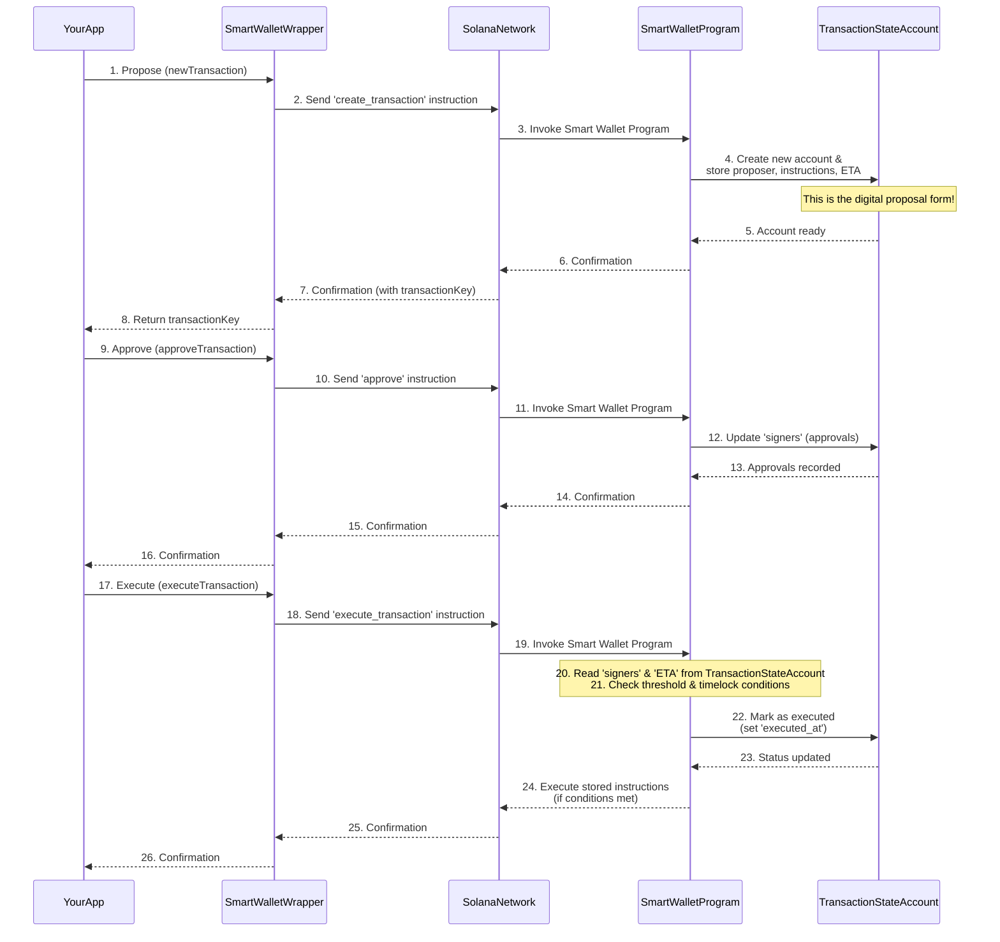

# Chapter 6: Transaction State Account

Welcome back, Goki explorers! In our previous chapter, [Smart Wallet Program](05_smart_wallet_program_.md), we learned that the Smart Wallet Program is the "brain" of your Goki Smart Wallet, enforcing all the rules for multi-signature actions and timelocks. But where does this "brain" keep track of all the proposed actions, who approved them, and when they are ready?

This is where the **Transaction State Account** comes in. It's a special place on the Solana blockchain specifically dedicated to holding all the temporary details of a *proposed* action that your Goki Smart Wallet needs to perform.

## The Digital Proposal Form

Imagine your Goki Smart Wallet is like a club's shared bank account, but on the blockchain. When someone wants to spend money or change a club rule, they don't just do it instantly. Instead, they fill out a "proposal form" and submit it. This form isn't the final action; it's a request that needs to be reviewed and approved by other members.

On the Solana blockchain, the **Transaction State Account** serves as this digital proposal form. When an owner uses their [SmartWalletWrapper](01_smartwalletwrapper_.md) to `newTransaction`, the [Smart Wallet Program](05_smart_wallet_program_.md) creates one of these accounts. It then records every detail about that specific proposed action, allowing other owners to review and approve it.

**What problem does it solve?** It provides a clear, transparent, and auditable record of every proposed action, tracking its progress through the multi-signature approval process until it's ready to be executed. It ensures that all necessary conditions ([Owners & Threshold](02_owners___threshold_.md), [Timelock](03_timelock_.md)) are met before the actual actions take place.

Our goal in this chapter is to understand how the **Transaction State Account** is the temporary "holding pen" for transactions, storing all the necessary information until they are ready to be finalized.

## Key Concepts: What a Transaction State Account Stores

The Transaction State Account is essentially a data storage unit on Solana. Here's a look at the crucial details it holds:

| Detail                  | Description                                                                                                                                                                                                                                |
| :---------------------- | :----------------------------------------------------------------------------------------------------------------------------------------------------------------------------------------------------------------------------------------- |
| **Proposer**            | The public key (address) of the owner who initially submitted this transaction proposal.                                                                                                                                                   |
| **Instructions**        | The exact list of Solana blockchain actions (like "send SOL to this address" or "change a setting") that the Smart Wallet needs to perform once the proposal is approved and executed.                                                    |
| **Signers (Approvals)** | A list of "Yes" or "No" for each owner of the Smart Wallet, indicating which owners have already given their approval for this specific transaction. This is how the [Smart Wallet Program](05_smart_wallet_program_.md) tracks the [Threshold](02_owners___threshold_.md). |
| **ETA (Timelock)**      | The "Estimated Time of Arrival" – a specific timestamp (in seconds since epoch) when this transaction is allowed to be executed. This enforces the [Timelock](03_timelock_.md) delay for this particular transaction.                      |
| **Status**              | It also keeps track of the transaction's lifecycle: whether it's still pending approvals, if it's already been executed, or if it expired.                                                                                                   |

Think of the `transactionKey` you've seen in previous examples (like `await smartWalletWrapper.newTransaction(...)`) as the unique address (Public Key) of this specific Transaction State Account on the blockchain.

## Using the Transaction State Account

As a user or developer, you don't directly manipulate the `Transaction State Account`. Instead, you interact with it through the convenient functions provided by the [SmartWalletWrapper](01_smartwalletwrapper_.md), which then tells the [Smart Wallet Program](05_smart_wallet_program_.md) what to do.

Let's revisit a familiar example, focusing on how the Transaction State Account is involved:

### 1. Proposing a Transaction (`newTransaction`)

When you propose a new action, the [Smart Wallet Program](05_smart_wallet_program_.md) creates a new Transaction State Account for it.

```typescript
import { SystemProgram } from "@solana/web3.js";
// Assume smartWalletWrapper is already set up from Chapter 1

const recipient = Keypair.generate().publicKey; // Our friend's address
const amountToSend = 0.1 * LAMPORTS_PER_SOL;

const transferInstruction = SystemProgram.transfer({
  fromPubkey: smartWalletWrapper.key, // From our Smart Wallet
  toPubkey: recipient,
  lamports: amountToSend,
});

// This action creates the Transaction State Account on chain
const { transactionKey, tx: proposeTx } =
  await smartWalletWrapper.newTransaction({
    proposer: ownerA.publicKey, // Proposer is recorded
    instructions: [transferInstruction], // Instructions are recorded
    // eta: new BN(Date.now() / 1000 + 60), // ETA (Timelock) can also be recorded
  });
proposeTx.signers.push(ownerA); // Sign the transaction to send the proposal
await proposeTx.confirm();
console.log("Transaction proposed. Its unique ID (Transaction State Account Address):", transactionKey.toBase58());
```
*Explanation*: When `smartWalletWrapper.newTransaction` is called, it sends a request to the [Smart Wallet Program](05_smart_wallet_program_.md) to create a new `Transaction State Account`. The program then populates this new account with the `proposer`, the `instructions`, and any `eta` (timelock) you might have set. The `transactionKey` returned is the unique address of this new Transaction State Account on the blockchain.

### 2. Checking the State (`fetchTransaction`)

You can easily read the current state of a proposed transaction (and its corresponding Transaction State Account) using `fetchTransaction`.

```typescript
// ... (previous code for transactionKey)

const txState = await smartWalletWrapper.fetchTransaction(transactionKey);
console.log("Details from Transaction State Account:");
console.log("  Proposer:", txState.proposer.toBase58());
console.log("  Instructions count:", txState.instructions.length);
console.log("  Approvals received:", txState.numApprovals.toNumber()); // This count comes from 'signers' field
console.log("  Execution time (ETA):", txState.eta.toNumber() === -1 ? "None" : new Date(txState.eta.toNumber() * 1000).toLocaleString());
```
*Explanation*: `smartWalletWrapper.fetchTransaction` simply reads the data stored in the `Transaction State Account` identified by `transactionKey`. This lets you see who proposed it, what it's trying to do, how many approvals it has received so far (based on its `signers` field), and its `eta` ([Timelock](03_timelock_.md)).

### 3. Approving a Transaction (`approveTransaction`)

When an owner approves a transaction, the [Smart Wallet Program](05_smart_wallet_program_.md) updates the relevant Transaction State Account.

```typescript
// ... (previous code for transactionKey)

// Owner B approves the transaction
await smartWalletWrapper
  .approveTransaction(transactionKey, ownerB.publicKey)
  .addSigners(ownerB)
  .confirm();
console.log("Transaction approved by Owner B.");

const updatedTxState = await smartWalletWrapper.fetchTransaction(transactionKey);
console.log("Approvals after Owner B:", updatedTxState.numApprovals.toNumber());
// The 'signers' list within the Transaction State Account has been updated!
```
*Explanation*: `smartWalletWrapper.approveTransaction` sends an instruction to the [Smart Wallet Program](05_smart_wallet_program_.md). The program then finds the `Transaction State Account` for `transactionKey` and marks `ownerB` as having approved it in its `signers` field.

### 4. Executing a Transaction (`executeTransaction`)

Once enough approvals are gathered and any [Timelock](03_timelock_.md) has passed, the `Transaction State Account` is marked as executed, and its stored instructions are run.

```typescript
// ... (previous code for transactionKey)

// Any owner (e.g., Owner C) can execute once conditions are met
await smartWalletWrapper
  .executeTransaction({
    transactionKey,
    owner: ownerC.publicKey,
  })
  .addSigners(ownerC)
  .confirm();
console.log("Transaction executed successfully!");

const finalTxState = await smartWalletWrapper.fetchTransaction(transactionKey);
console.log("Transaction executed at:", new Date(finalTxState.executed_at.toNumber() * 1000).toLocaleString());
// The 'executed_at' field in the Transaction State Account is now updated!
```
*Explanation*: When `smartWalletWrapper.executeTransaction` is called, the [Smart Wallet Program](05_smart_wallet_program_.md) reads the `Transaction State Account` to verify the `threshold` and `eta` conditions. If met, it then executes the `instructions` stored within this account. Finally, it marks the `Transaction State Account` itself as `executed` (by setting `executed_at`), preventing it from being run again.

## Under the Hood: The Transaction State Account's Lifecycle

The Transaction State Account is created and managed directly by the [Smart Wallet Program](05_smart_wallet_program_.md). It's a temporary account that tracks the status of a specific proposed action.

Here's a simplified flow of how the `Transaction State Account` is used:


*Explanation*:
1.  **Creation**: When `newTransaction` is called, the [Smart Wallet Program](05_smart_wallet_program_.md) creates a new `Transaction State Account` on the blockchain. This account is filled with the transaction's details: who proposed it, what instructions it contains, and its optional [Timelock](03_timelock_.md) `eta`.
2.  **Updates**: When `approveTransaction` is called, the [Smart Wallet Program](05_smart_wallet_program_.md) updates the `signers` field within that specific `Transaction State Account` to record the new approval.
3.  **Validation & Execution**: When `executeTransaction` is called, the [Smart Wallet Program](05_smart_wallet_program_.md) reads the `Transaction State Account`. It checks the `signers` list against the `threshold` (from the main `SmartWallet` account) and the current time against the `eta` ([Timelock](03_timelock_.md)). If all conditions are met, the program then executes the `instructions` stored in the `Transaction State Account` on behalf of the Smart Wallet. Finally, it updates the `Transaction State Account` itself to mark it as `executed` (by setting `executed_at`), preventing it from being run again.

### Diving into the Code (Simplified)

Let's look at simplified Rust code snippets from the [Smart Wallet Program](05_smart_wallet_program_.md) (`programs/smart-wallet/src/`) to see how the `Transaction State Account` is defined and used.

**1. Defining the Transaction State Account (`state.rs`)**
The `Transaction` struct is the blueprint for the data stored in each Transaction State Account.

```rust
// programs/smart-wallet/src/state.rs
// ...
#[account]
#[derive(Debug, Default, PartialEq)]
pub struct Transaction {
    pub smart_wallet: Pubkey,
    pub index: u64,
    pub bump: u8,
    pub proposer: Pubkey,
    pub instructions: Vec<TXInstruction>, // The actions to perform!
    pub signers: Vec<bool>,              // True if owner at index has approved
    pub owner_set_seqno: u32,
    pub eta: i64,                        // Timelock ETA
    pub executor: Pubkey,
    pub executed_at: i64,                // When it was executed (-1 if not)
}
// ...
```
*Explanation*: This `Transaction` struct clearly shows the fields we discussed: `proposer`, `instructions`, `signers` (the list of approvals), and `eta` (for [Timelock](03_timelock_.md)). The `executed_at` field tracks whether the transaction has been completed. Each `Transaction State Account` on the blockchain holds this exact structure.

**2. Creating the Transaction State Account (`lib.rs`)**
This is how the program initially fills the `Transaction State Account`.

```rust
// programs/smart-wallet/src/lib.rs
// ...
pub fn create_transaction_with_timelock(
    ctx: Context<CreateTransaction>,
    _bump: u8,
    instructions: Vec<TXInstruction>, // Input instructions
    eta: i64,                         // Input ETA
) -> Result<()> {
    // ... validation checks for ETA ...

    // The 'transaction' account in 'ctx.accounts' refers to the new Transaction State Account
    let tx = &mut ctx.accounts.transaction;
    tx.proposer = ctx.accounts.proposer.key(); // Store proposer
    tx.instructions = instructions.clone();     // Store instructions
    tx.eta = eta;                               // Store ETA

    // Initialize signers list (proposer is always first signer)
    let smart_wallet = &ctx.accounts.smart_wallet;
    let owner_index = smart_wallet.try_owner_index(ctx.accounts.proposer.key())?;
    let mut signers = Vec::new();
    signers.resize(smart_wallet.owners.len(), false);
    signers[owner_index] = true;
    tx.signers = signers; // Store initial approvals

    // ... other initializations ...
    Ok(())
}
// ...
```
*Explanation*: When `create_transaction_with_timelock` is called, the [Smart Wallet Program](05_smart_wallet_program_.md) creates a new `Transaction State Account` (referred to as `ctx.accounts.transaction`). It then populates the `proposer`, `instructions`, `eta`, and `signers` fields based on the function's inputs and initial logic (e.g., the proposer automatically approves).

**3. Updating Approvals in the Account (`instructions/approve.rs`)**
This shows how approvals modify the `signers` field.

```rust
// programs/smart-wallet/src/instructions/approve.rs
// ...
pub fn handler(ctx: Context<Approve>) -> Result<()> {
    // Check if the signing 'owner' is valid
    let owner_index = ctx
        .accounts
        .smart_wallet
        .try_owner_index(ctx.accounts.owner.key())?;

    // Mark the owner's approval in the Transaction State Account
    ctx.accounts.transaction.signers[owner_index] = true;

    // ... emit event ...
    Ok(())
}
// ...
```
*Explanation*: When an owner approves, this `approve` handler within the [Smart Wallet Program](05_smart_wallet_program_.md) is invoked. It finds the index of the approving owner and then sets the corresponding `boolean` to `true` in the `signers` array of the `Transaction State Account` (`ctx.accounts.transaction`).

**4. Reading and Executing from the Account (`lib.rs`)**
The execution logic relies heavily on the data within the Transaction State Account.

```rust
// programs/smart-wallet/src/lib.rs
// ...
pub fn execute_transaction(ctx: Context<ExecuteTransaction>) -> Result<()> {
    let smart_wallet = &ctx.accounts.smart_wallet; // Get Smart Wallet config
    let tx = &mut ctx.accounts.transaction;        // Get Transaction State Account data
    let clock = Clock::get()?;
    let current_ts = clock.unix_timestamp;

    // 1. Check if Timelock has passed, using 'eta' from the Transaction State Account
    invariant!(current_ts >= tx.eta, TransactionNotReady);

    // 2. Check if enough owners have signed, using 'signers' from the Transaction State Account
    let sig_count = tx.num_signers();
    invariant!((sig_count as u64) >= smart_wallet.threshold, NotEnoughSigners);

    // 3. If conditions met, execute the instructions stored in the Transaction State Account
    for ix in tx.instructions.iter() {
        solana_program::program::invoke_signed(&(ix).into(), ctx.remaining_accounts, seeds)?;
    }

    // 4. Mark the transaction as executed in the Transaction State Account
    tx.executor = ctx.accounts.owner.key();
    tx.executed_at = current_ts;

    // ... emit event ...
    Ok(())
}
// ...
```
*Explanation*: The `execute_transaction` function first retrieves the `Transaction State Account` data (`tx`). It then uses `tx.eta` to check [Timelock](03_timelock_.md) and `tx.num_signers()` (which counts `true` values in `tx.signers`) to check the [Threshold](02_owners___threshold_.md). If both pass, it iterates through `tx.instructions` and executes each one. Finally, it updates `tx.executed_at` to mark the transaction as complete.

The Transaction State Account is truly the central hub for all pending and completed multi-signature activities within a Goki Smart Wallet.

## Conclusion

The **Transaction State Account** is a fundamental component of the Goki Protocol, acting as the dedicated on-chain record for every proposed action of a Smart Wallet. It meticulously stores all the details, from the initial proposal and its instructions to the ongoing approvals and any time-based restrictions. This transparent and persistent record is crucial for ensuring that multi-signature rules are correctly enforced and that actions are only executed when all conditions are met.

Now that we understand how proposed transactions are recorded and tracked, let's move on to the next exciting step: how the [Smart Wallet Program](05_smart_wallet_program_.md) actually *performs* the instructions stored in the Transaction State Account using a powerful Solana feature called [Instruction Execution (CPI)](07_instruction_execution__cpi__.md).

---
 <sub><sup>**References**: [[1]](https://github.com/GokiProtocol/goki/blob/87aff0569301acd16f3bdcbfec09cae6ba3e62cc/programs/smart-wallet/src/lib.rs), [[2]](https://github.com/GokiProtocol/goki/blob/87aff0569301acd16f3bdcbfec09cae6ba3e62cc/programs/smart-wallet/src/state.rs), [[3]](https://github.com/GokiProtocol/goki/blob/87aff0569301acd16f3bdcbfec09cae6ba3e62cc/src/wrappers/smartWallet/index.ts)</sup></sub>