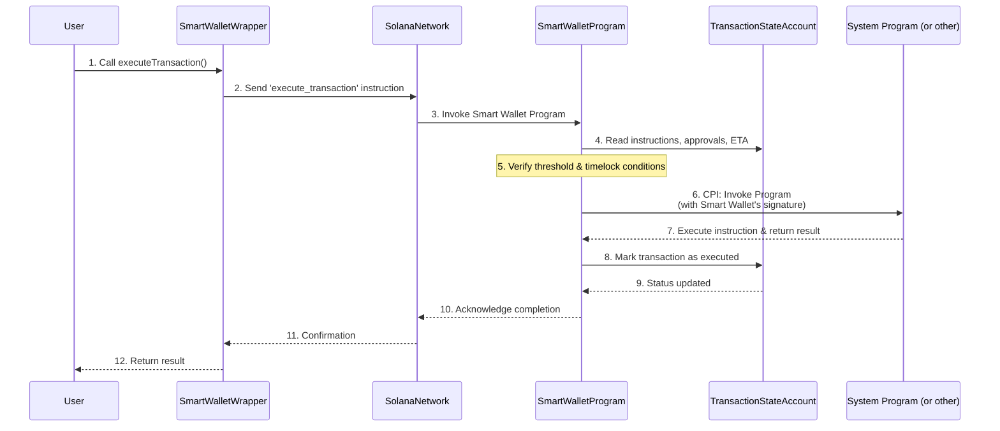

# Chapter 7: Instruction Execution (CPI)

Welcome back, Goki explorers! In our previous chapter, [Transaction State Account](06_transaction_state_account_.md), we learned that the Smart Wallet Program stores all the details of a proposed transaction, including the actual instructions to be performed, in a special `Transaction State Account`. But how does the Smart Wallet actually *perform* those instructions? It's not like the Smart Wallet itself is a general-purpose computer that can just "do" anything.

This is where **Instruction Execution (CPI)** comes in. At its core, your Goki Smart Wallet doesn't directly perform actions like sending SOL or modifying accounts. Instead, it acts as a powerful signer that can authorize and execute instructions from *other* Solana programs on its behalf.

## The CEO and Their Departments

Imagine a busy CEO (your Goki Smart Wallet) who needs many different tasks done: sending money, creating new projects, or hiring new staff. The CEO doesn't do all these tasks themselves. Instead, they have specialized departments (other Solana programs) for each job:
*   The "Finance Department" (Solana System Program) for sending SOL.
*   The "Token Department" (Solana SPL Token Program) for managing tokens.
*   And so on.

When the CEO wants something done, they write a clear request (an "instruction") and then digitally *sign* it with their authority, handing it over to the correct department. The department then performs the task, knowing it has the CEO's official approval.

On Solana, this delegation of tasks is achieved through **Cross-Program Invocation (CPI)**. Your Goki Smart Wallet Program can "call" another program, digitally signing the instruction with its own authority (or the authority of one of its derived addresses). It's like a central command center delegating tasks to specialized departments while maintaining overall control.

**What problem does it solve?** It allows your Goki Smart Wallet to interact with any other program on Solana. The Smart Wallet itself only needs to know *how to delegate*, not *how to perform every single blockchain operation*. This makes it incredibly flexible and powerful, as it can manage anything that Solana programs can do.

## Key Concepts: Delegating with Authority

Let's break down how CPI works in the context of your Goki Smart Wallet:

| Concept                      | Description                                                                                                                                                                                                                            |
| :--------------------------- | :------------------------------------------------------------------------------------------------------------------------------------------------------------------------------------------------------------------------------------- |
| **Cross-Program Invocation (CPI)** | The act of one Solana program calling or "invoking" another Solana program. It's how programs interact and build on top of each other.                                                                                                |
| **Delegation**               | The Smart Wallet doesn't execute the final action itself. It delegates the task to the specific program designed to perform that action (e.g., the System Program for transfers).                                                           |
| **Signing Authority**        | Crucially, when the Smart Wallet delegates, it also provides its own digital "signature" (or the signature of one of its [Program Derived Addresses (PDAs)](08_program_derived_addresses__pdas_.md)). This signature gives the delegated instruction the authority of the Smart Wallet, allowing it to spend SOL from the Smart Wallet, or change settings for accounts owned by the Smart Wallet. |
| **Instructions (from other programs)** | The actions stored in the [Transaction State Account](06_transaction_state_account_.md) are not Goki's own instructions. They are standard Solana `TransactionInstruction` objects meant for *other* programs. For example, `SystemProgram.transfer` is an instruction for the Solana System Program. |

## How the Smart Wallet Uses CPI for Execution

Recall the `executeTransaction` function from your [SmartWalletWrapper](01_smartwalletwrapper_.md). This is where CPI happens.

When you call `executeTransaction`, here's how the Smart Wallet uses CPI:

### 1. Proposing a Transaction with an External Instruction

First, you define an instruction for another program. For example, to send SOL, you use `SystemProgram.transfer`, which is an instruction for the Solana System Program:

```typescript
import { SystemProgram } from "@solana/web3.js";
// Assume smartWalletWrapper is already set up from Chapter 1

const recipient = Keypair.generate().publicKey;
const amountToSend = 0.1 * LAMPORTS_PER_SOL;

// This instruction is for the Solana System Program!
const transferInstruction = SystemProgram.transfer({
  fromPubkey: smartWalletWrapper.key, // Smart Wallet is the sender
  toPubkey: recipient,
  lamports: amountToSend,
});

// Propose the transaction, storing the SystemProgram.transfer instruction
const { transactionKey, tx: proposeTx } =
  await smartWalletWrapper.newTransaction({
    proposer: ownerA.publicKey,
    instructions: [transferInstruction], // This is what gets stored
  });
proposeTx.signers.push(ownerA);
await proposeTx.confirm();
console.log("Transfer transaction proposed. ID:", transactionKey.toBase58());
```
*Explanation*: The `transferInstruction` is a standard Solana instruction telling the `SystemProgram` to move SOL. When `newTransaction` is called, this instruction (including its `programId`, `keys`, and `data`) is stored inside the [Transaction State Account](06_transaction_state_account_.md) on the blockchain.

### 2. Executing the Transaction (CPI in Action)

Once enough [Owners & Threshold](02_owners___threshold_.md) are met and any [Timelock](03_timelock_.md) has passed, you call `executeTransaction`. This is when the Smart Wallet performs CPI.

```typescript
// ... (previous code for transactionKey)

// Execute the transaction
await smartWalletWrapper
  .executeTransaction({
    transactionKey,
    owner: ownerA.publicKey,
  })
  .addSigners(ownerA)
  .confirm();
console.log("Transaction executed successfully!");
// At this point, the Smart Wallet has delegated to the SystemProgram,
// and 0.1 SOL has been sent to the recipient!
```
*Explanation*: When `executeTransaction` is confirmed, the [Smart Wallet Program](05_smart_wallet_program_.md) on the blockchain retrieves the `transferInstruction` from the [Transaction State Account](06_transaction_state_account_.md). It then performs a CPI call, telling the Solana runtime: "Hey, System Program! Please execute this `transferInstruction`, and let me, the Smart Wallet, sign for it!" The System Program then performs the transfer, decrementing the SOL balance of the Smart Wallet.

## Under the Hood: CPI in the Smart Wallet Program

The actual CPI magic happens within the [Smart Wallet Program](05_smart_wallet_program_.md)'s `execute_transaction` function (or `execute_transaction_derived`, for [PDAs](08_program_derived_addresses__pdas_.md)).

Here's a simplified view of the flow:


*Explanation*:
1.  **User Initiates**: You call `executeTransaction` on your `smartWalletWrapper`.
2.  **Instruction to Network**: The `SmartWalletWrapper` prepares an `execute_transaction` instruction for the [Smart Wallet Program](05_smart_wallet_program_.md) and sends it to the Solana network.
3.  **Program Invoked**: The Solana network routes this instruction to the [Smart Wallet Program](05_smart_wallet_program_.md).
4.  **Read Transaction**: The [Smart Wallet Program](05_smart_wallet_program_.md) fetches the details of the proposed transaction from its [Transaction State Account](06_transaction_state_account_.md).
5.  **Checks & Balances**: It verifies that enough owners have approved (meeting the [Threshold](02_owners___threshold_.md)) and that the [Timelock](03_timelock_.md) (ETA) has passed. If these conditions are not met, the transaction fails here.
6.  **CPI Call (`invoke_signed`)**: If all checks pass, the [Smart Wallet Program](05_smart_wallet_program_.md) takes the `instructions` stored in the [Transaction State Account](06_transaction_state_account_.md). For *each* of these instructions, it makes a special **CPI call** using a Solana function called `invoke_signed`. This function tells the Solana runtime to execute the instruction *as if the Smart Wallet itself (or one of its [Program Derived Addresses (PDAs)](08_program_derived_addresses__pdas_.md)) had directly signed it*.
7.  **Other Program Acts**: The target program (e.g., System Program) receives this CPI-invoked instruction, recognizes the Smart Wallet's signature, and performs the requested action (e.g., transfers SOL).
8.  **Program Finalizes**: After all delegated instructions are successfully executed, the [Smart Wallet Program](05_smart_wallet_program_.md) marks the [Transaction State Account](06_transaction_state_account_.md) as executed.
9.  **Confirmation**: The Solana network confirms the overall transaction, and the result is returned to your `SmartWalletWrapper` and then to your application.

### Diving into the Code (Simplified)

Let's look at the critical part in the [Smart Wallet Program](05_smart_wallet_program_.md) (`programs/smart-wallet/src/lib.rs`) where CPI happens:

```rust
// Simplified from programs/smart-wallet/src/lib.rs

fn do_execute_transaction(ctx: Context<ExecuteTransaction>, seeds: &[&[&[u8]]]) -> Result<()> {
    // ... (previous checks for timelock and threshold) ...

    // Iterate through each instruction stored in the Transaction State Account
    for ix in ctx.accounts.transaction.instructions.iter() {
        // This is the CPI call!
        // It executes the instruction 'ix' by calling the program specified in ix.program_id,
        // and provides 'seeds' so the Smart Wallet (or its PDA) can sign.
        solana_program::program::invoke_signed(&(ix).into(), ctx.remaining_accounts, seeds)?;
    }

    // Mark the transaction as executed to prevent re-execution
    let tx = &mut ctx.accounts.transaction;
    tx.executor = ctx.accounts.owner.key();
    tx.executed_at = Clock::get()?.unix_timestamp;

    // ... emit event ...
    Ok(())
}
```
*Explanation*: The key line is `solana_program::program::invoke_signed(...)`. This is the Solana runtime function that allows one program (our Smart Wallet Program) to call another program (like the System Program) and have that call signed by a **Program Derived Address (PDA)** associated with the Smart Wallet. The `seeds` argument is crucial here; it provides the unique "secret recipe" for the PDA's signature, allowing the Smart Wallet to delegate its authority.

The `SmartWalletWrapper` (`src/wrappers/smartWallet/index.ts`) plays a role in gathering all the necessary accounts for this CPI call:

```typescript
// Simplified from src/wrappers/smartWallet/index.ts
// Inside SmartWalletWrapper class, _fetchExecuteTransactionContext function:

private async _fetchExecuteTransactionContext({
  transactionKey,
  owner = this.provider.wallet.publicKey,
  walletDerivedAddress = null, // Could be the main Smart Wallet or a derived address
}: {
  transactionKey: PublicKey;
  owner?: PublicKey;
  walletDerivedAddress?: PublicKey | null;
}) {
  const data = await this.fetchTransaction(transactionKey); // Fetch the stored instructions
  return {
    accounts: {
      smartWallet: this.key,
      transaction: transactionKey,
      owner,
    },
    // Prepare remainingAccounts for the CPI call
    remainingAccounts: data.instructions.flatMap((ix) => [
      {
        pubkey: ix.programId, // The program to be invoked
        isSigner: false,
        isWritable: false,
      },
      ...ix.keys.map((k) => { // Accounts involved in the delegated instruction
        // If the account is the Smart Wallet itself (or a derived address)
        // and it's marked as a signer, it needs to be made non-signer here
        // because the CPI call will provide the signature.
        if (
          k.isSigner &&
          ((walletDerivedAddress && k.pubkey.equals(walletDerivedAddress)) ||
            k.pubkey.equals(this.key))
        ) {
          return {
            ...k,
            isSigner: false, // Smart Wallet provides signature via PDA in CPI
          };
        }
        return k;
      }),
    ]),
  };
}
```
*Explanation*: Before the `execute_transaction` instruction is sent to the Smart Wallet Program, `_fetchExecuteTransactionContext` examines the instructions stored in the `Transaction State Account`. It gathers all the `accounts` (including the `programId` and `keys`) that the CPI call will need. Importantly, if the Smart Wallet itself (or its derived address) is listed as a signer in the inner instruction (like `fromPubkey` in our `SystemProgram.transfer`), its `isSigner` flag is set to `false` here. This is because the Smart Wallet Program, through `invoke_signed`, will provide the *cryptographic signature* for that account, not an external user's wallet.

CPI is a fundamental concept on Solana, enabling programs to interact securely and efficiently. Your Goki Smart Wallet leverages CPI to become a versatile manager of digital assets, capable of initiating any action across the Solana ecosystem once the multi-signature conditions are met.

## Conclusion

**Instruction Execution (CPI)** is how your Goki Smart Wallet, acting as a powerful central authority, delegates tasks to other specialized programs on the Solana blockchain. By digitally signing these delegated instructions with its own authority (often through a PDA), the Smart Wallet can perform a wide range of actions, from sending SOL to managing tokens, all under the strict multi-signature and timelock rules you define. This mechanism makes Goki incredibly flexible and a true "smart" wallet.

In the next chapter, we will take a closer look at [Program Derived Addresses (PDAs)](08_program_derived_addresses__pdas_.md), the special types of addresses frequently used by programs like Goki to sign for CPI calls and manage assets on the blockchain without needing a private key.

---
<sub><sup>**References**: [[1]](https://github.com/GokiProtocol/goki/blob/87aff0569301acd16f3bdcbfec09cae6ba3e62cc/programs/smart-wallet/src/lib.rs), [[2]](https://github.com/GokiProtocol/goki/blob/87aff0569301acd16f3bdcbfec09cae6ba3e62cc/src/programs/smartWallet.ts), [[3]](https://github.com/GokiProtocol/goki/blob/87aff0569301acd16f3bdcbfec09cae6ba3e62cc/src/wrappers/smartWallet/index.ts), [[4]](https://github.com/GokiProtocol/goki/blob/87aff0569301acd16f3bdcbfec09cae6ba3e62cc/tests/smartWallet.spec.ts)</sup></sub>