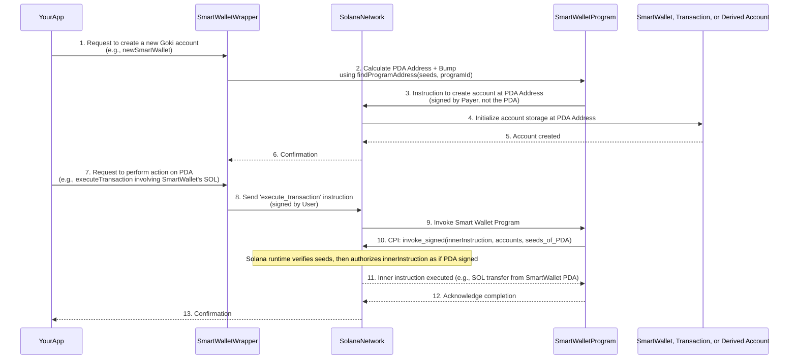

# Chapter 8: Program Derived Addresses (PDAs)

Welcome back, Goki explorers! In our last chapter, [Instruction Execution (CPI)](07_instruction_execution__cpi__.md), we discovered how your Goki Smart Wallet (through its program) can delegate tasks to other Solana programs by "signing" on behalf of itself. But how exactly does a program, which doesn't have a secret key like a human wallet, manage to "sign" anything or "own" accounts?

This is where **Program Derived Addresses (PDAs)** come into play. PDAs are a fundamental and magical concept on Solana that allows programs to truly own and control accounts, making powerful applications like Goki possible.

## The Company Vault Analogy

Imagine a large corporation that needs its own bank accounts for various departments: one for payroll, one for operations, one for marketing. They don't want a single person's private key to control these main company accounts. Instead, they want the *company itself* (the corporation's internal rules and systems) to be the sole authority.

On Solana, a "program" is like this corporation. It's a piece of software living on the blockchain. A **Program Derived Address (PDA)** is like a "company bank account" that **only the program itself** can control. It's a special kind of Public Key that doesn't have a private key. This means no one can ever "steal" the secret key because it doesn't exist! Only the specific program that *derived* that address can sign for it.

**What problem does it solve?** PDAs allow Solana programs to securely manage and own digital assets and data without needing a human to hold a private key for those specific accounts. This is crucial for building complex applications like Goki, where the Smart Wallet itself needs to hold funds and execute transactions based on its multi-signature rules, rather than relying on an external, individual wallet.

In Goki, PDAs are used for several key purposes:

| PDA Use Case               | Description                                                                                                                                                                             |
| :------------------------- | :-------------------------------------------------------------------------------------------------------------------------------------------------------------------------------------- |
| **The `SmartWallet` Account** | The main account that holds your Smart Wallet's configuration ([Owners & Threshold](02_owners___threshold_.md), [Timelock](03_timelock_.md)). It's a PDA, enabling the Goki program to control its own settings.                                                      |
| **`Transaction` Accounts** | Each proposed transaction is stored in its own unique [Transaction State Account](06_transaction_state_account_.md), which is also a PDA. This allows the Goki program to manage and update its state securely.                                                |
| **"Derived Wallets"**      | Special sub-accounts that act as extensions of the main Smart Wallet. These are PDAs and can hold specific assets, allowing for advanced fund management strategies.                                 |
| **"Owner Invokers"**       | Unique PDAs tied to specific owners or functions, allowing for very fine-grained control and delegation within the Smart Wallet's ecosystem.                                                              |

## Key Concepts: The Magic of PDAs

Let's break down how these special addresses work.

### 1. Public Keys vs. PDAs: The "No Private Key" Difference

*   **Regular Public Key**: You generate a `Keypair`, which gives you a `PublicKey` and a matching `PrivateKey`. Anyone with the `PrivateKey` can sign for that `PublicKey`.
*   **Program Derived Address (PDA)**: This is *also* a `PublicKey`. However, it **does not have a matching `PrivateKey`**. It cannot be controlled by a human wallet. Instead, it is cryptographically linked to a specific Solana program.

### 2. Deterministic Generation: Seeds and Bumps

How do programs "create" these addresses without a private key? They use a process called **deterministic generation**. This means the address is always the same if you provide the same inputs.

*   **Program ID**: Every PDA is linked to a specific **Program ID** (the unique address of the program on Solana, like `GokivDYuQXPZCWRkwMhdH2h91KpDQXBEmpgBgs55bnpH` for the Smart Wallet Program).
*   **Seeds**: These are like ingredients in a recipe. They are a series of bytes (often strings, public keys, or numbers) that are combined with the Program ID. The combination of the Program ID and these seeds *deterministically* generates the PDA. If you use the same Program ID and the same seeds, you will *always* get the same PDA.
*   **Bump**: Sometimes, a particular combination of seeds might accidentally result in a valid `PublicKey` that *does* have a corresponding `PrivateKey` (this is extremely rare but possible, known as a `P-256` curve point). To avoid this, Solana adds an extra byte called a "bump seed" or "bump" to the combination. The system automatically finds a `bump` value that ensures the resulting address *cannot* be signed by a private key. This is why when you derive a PDA, you often get back both the `PublicKey` and its `bump` value.

The function used to find a PDA is `PublicKey.findProgramAddress([seeds], programId)`.

### 3. Only the Program Can Sign

This is the most crucial part: **only the program that deterministically generated a PDA can "sign" for it**. When a program wants to act on behalf of a PDA (e.g., transfer SOL from it), it uses a special instruction called `invoke_signed`. This instruction proves to the Solana runtime that the calling program is indeed the "owner" of the PDA, allowing it to authorize actions for that PDA.

## How Goki Uses PDAs

Let's look at how Goki leverages PDAs for its core functionality:

### 1. The `SmartWallet` Account Itself

Your main Goki Smart Wallet account is a PDA. This is fundamental because it means the [Smart Wallet Program](05_smart_wallet_program_.md) can truly own and control it.

*   **Seeds**: `["GokiSmartWallet", base_public_key]`
    *   `"GokiSmartWallet"`: A fixed string, a unique identifier for the Smart Wallet type.
    *   `base_public_key`: A public key generated by your regular user wallet. This acts as a unique base for your Smart Wallet.
*   **Why a PDA?**: By making the `SmartWallet` account a PDA, the [Smart Wallet Program](05_smart_wallet_program_.md) can, for instance, transfer SOL directly from this account (once multi-signature conditions are met) using `invoke_signed`.

### 2. `Transaction` Accounts

Every time you propose a new transaction using `smartWalletWrapper.newTransaction`, a new [Transaction State Account](06_transaction_state_account_.md) is created on the blockchain. This account is also a PDA.

*   **Seeds**: `["GokiTransaction", smart_wallet_public_key, transaction_index]`
    *   `"GokiTransaction"`: Another fixed string.
    *   `smart_wallet_public_key`: The address of your main `SmartWallet` PDA.
    *   `transaction_index`: A unique number for each transaction created by that `SmartWallet`.
*   **Why a PDA?**: This ensures each transaction proposal has a unique, program-controlled address where its state (instructions, approvals, [Timelock](03_timelock_.md)) can be stored and updated exclusively by the [Smart Wallet Program](05_smart_wallet_program_.md).

### 3. Derived Wallets

Goki also allows you to create "derived wallets." These are sub-accounts of your main `SmartWallet` that can hold tokens or SOL separately. They are also PDAs.

*   **Seeds**: `["GokiSmartWalletDerived", smart_wallet_public_key, wallet_index]`
    *   `"GokiSmartWalletDerived"`: A fixed string.
    *   `smart_wallet_public_key`: The address of your main `SmartWallet` PDA.
    *   `wallet_index`: A unique number for each derived wallet you create.
*   **Why a PDA?**: This allows the main `SmartWallet` (via the [Smart Wallet Program](05_smart_wallet_program_.md)) to sign for actions related to these derived wallets. For example, a derived wallet could hold a specific token type, and the `SmartWallet` could approve transactions to send those tokens without directly interacting with the main Smart Wallet's SOL balance.

### 4. Owner Invokers

Owner Invokers are another type of PDA, enabling advanced permissions and interactions.

*   **Seeds**: `["GokiSmartWalletOwnerInvoker", smart_wallet_public_key, invoker_index]`
    *   `"GokiSmartWalletOwnerInvoker"`: A fixed string.
    *   `smart_wallet_public_key`: The address of your main `SmartWallet` PDA.
    *   `invoker_index`: A unique number for each owner invoker.
*   **Why a PDA?**: These allow specific `owners` (or the `SmartWallet` itself) to delegate very specific, pre-defined actions via CPI, without needing a full multi-signature process for every minor action. It's for more advanced, fine-tuned control scenarios.

## Example: Finding PDA Addresses

You won't typically "create" PDAs directly as a user; the [Goki SDK](04_goki_sdk_.md) and [Smart Wallet Program](05_smart_wallet_program_.md) handle that. However, you can always *find* the address of a PDA given its seeds.

Let's see how the `SmartWalletWrapper` helps you find the addresses of the main Smart Wallet and its derived addresses:

```typescript
import { Keypair, PublicKey } from "@solana/web3.js";
import { makeSDK } from "./workspace";
import BN from "bn.js";

const sdk = makeSDK();
const ownerA = Keypair.generate();
const owners = [ownerA.publicKey];
const threshold = new BN(1);
const delaySeconds = new BN(0);

// Use a known base for a reproducible Smart Wallet PDA
const baseKeypair = Keypair.generate();

// Create the Smart Wallet. Its address is a PDA!
const { smartWalletWrapper, tx } = await sdk.newSmartWallet({
  numOwners: owners.length,
  owners,
  threshold,
  delay: delaySeconds,
  base: baseKeypair, // We provide the base keypair here
});
await tx.confirm();

console.log("Main Smart Wallet PDA Address:", smartWalletWrapper.key.toBase58());
// Example Output: Main Smart Wallet PDA Address: B5fD4f...

// Find a Wallet Derived Address for an index (e.g., 0)
const [derivedWallet0, derivedBump0] =
  await smartWalletWrapper.findWalletDerivedAddress(0);
console.log("Derived Wallet (Index 0) PDA Address:", derivedWallet0.toBase58());
// Example Output: Derived Wallet (Index 0) PDA Address: 2N3xYt...

// Find a Transaction PDA address for a specific index (e.g., 0, first transaction)
const [txPDA, txBump] = await smartWalletWrapper.findTransactionAddress(0);
console.log("First Transaction PDA Address:", txPDA.toBase58());
// Example Output: First Transaction PDA Address: 6PcV3u...
```
*Explanation*:
1.  We first create a new `SmartWallet`. The `smartWalletWrapper.key` property *is* the PDA for your Smart Wallet. It was derived using the `baseKeypair` you provided and the `GokiSmartWallet` string.
2.  Then, we use `smartWalletWrapper.findWalletDerivedAddress(0)` to calculate the PDA for a "derived wallet" at index 0. This PDA uses the `smartWalletWrapper.key` (the main Smart Wallet's PDA) and the index `0` as seeds.
3.  Similarly, `smartWalletWrapper.findTransactionAddress(0)` calculates the PDA for the *first* transaction (`index: 0`) associated with this Smart Wallet.

These functions within the `SmartWalletWrapper` (which rely on utilities in `src/wrappers/smartWallet/pda.ts`) simply re-run the `findProgramAddress` calculation to show you what the PDA address *would be* for a given set of seeds, even before the account is actually created on-chain.

## Under the Hood: PDA Generation and Signing

The "magic" of PDAs is orchestrated by the Solana runtime and the `Smart Wallet Program` itself.


*Explanation*:
1.  **PDA Calculation**: When you ask the `SmartWalletWrapper` to create a new Goki-related account (like a new Smart Wallet or a Transaction account), the `SmartWalletProgram` first *calculates* the PDA address and its `bump` using `findProgramAddress` based on the specified seeds.
2.  **Account Creation**: The program then sends an instruction to the Solana runtime to create a new account *at that specific PDA address*. This creation transaction is paid for and signed by your regular wallet, not the PDA itself.
3.  **Program Control**: Once the account exists at the PDA, it can only be controlled by the `SmartWalletProgram`. When the program wants to perform an action *from* or *on behalf of* this PDA (e.g., transferring SOL from the `SmartWallet` PDA, as seen in [Instruction Execution (CPI)](07_instruction_execution__cpi__.md)), it uses the `invoke_signed` function.
4.  **`invoke_signed`**: This special function takes the inner instruction (e.g., `SystemProgram.transfer`), a list of accounts involved, and *critically*, the `seeds` (and `bump`) that were used to derive the PDA. The Solana runtime then verifies that the calling program indeed *could* have derived that PDA with those seeds. If it passes, the runtime allows the inner instruction to proceed as if the PDA itself had cryptographically signed it.

### Diving into the Code (Simplified)

Let's look at simplified Rust code snippets from the [Smart Wallet Program](05_smart_wallet_program_.md) (`programs/smart-wallet/src/`) and the SDK (`src/wrappers/smartWallet/pda.ts`) to see how PDAs are derived and used.

**1. Finding PDAs in the SDK (`src/wrappers/smartWallet/pda.ts`)**

These utility functions in the SDK implement `PublicKey.findProgramAddress` to find the addresses:

```typescript
// Simplified from src/wrappers/smartWallet/pda.ts

import { utils } from "@project-serum/anchor";
import { PublicKey } from "@solana/web3.js";
import { GOKI_ADDRESSES } from "../../constants"; // Contains the Smart Wallet Program ID

// Function to find the main Smart Wallet PDA address
export const findSmartWallet = async (
  base: PublicKey
): Promise<[PublicKey, number]> => {
  return await PublicKey.findProgramAddress(
    [utils.bytes.utf8.encode("GokiSmartWallet"), base.toBuffer()], // Seeds
    GOKI_ADDRESSES.SmartWallet // Program ID
  );
};

// Function to find a Transaction PDA address
export const findTransactionAddress = async (
  smartWallet: PublicKey, // The main Smart Wallet's PDA
  index: number // The transaction's index
): Promise<[PublicKey, number]> => {
  return await PublicKey.findProgramAddress(
    [
      utils.bytes.utf8.encode("GokiTransaction"),
      smartWallet.toBuffer(),
      new u64(index).toBuffer(), // Convert index to buffer for seed
    ],
    GOKI_ADDRESSES.SmartWallet
  );
};
```
*Explanation*: These SDK functions simply use `PublicKey.findProgramAddress` with the correct string seeds (`"GokiSmartWallet"`, `"GokiTransaction"`) and `PublicKey` seeds (like `base` or `smartWallet.toBuffer()`) along with the `GOKI_ADDRESSES.SmartWallet` (the Program ID) to calculate the PDA.

**2. Signing with a PDA in the Program (`programs/smart-wallet/src/lib.rs`)**

Recall the `do_execute_transaction` function from [Instruction Execution (CPI)](07_instruction_execution__cpi__.md). This is where the Smart Wallet Program uses the PDA's "signature".

```rust
// Simplified from programs/smart-wallet/src/lib.rs

fn do_execute_transaction(ctx: Context<ExecuteTransaction>, seeds: &[&[&[u8]]]) -> Result<()> {
    // ... (previous checks) ...

    for ix in ctx.accounts.transaction.instructions.iter() {
        // This is the CPI call where the PDA "signs"!
        // 'seeds' here are the same seeds used to derive the PDA.
        solana_program::program::invoke_signed(&(ix).into(), ctx.remaining_accounts, seeds)?;
    }

    // ... (finalize transaction) ...
    Ok(())
}
```
*Explanation*: The crucial part is `invoke_signed`. When the `SmartWalletProgram` calls this, it provides the `seeds` (e.g., `wallet_seeds` or `invoker_seeds` from the full code, which correspond to the PDA's derivation seeds). The Solana runtime uses these seeds to confirm that this specific program is indeed the one authorized to sign for the PDA-controlled account, enabling the inner instruction (like transferring SOL) to proceed.

For example, when `execute_transaction` is called, the `wallet_seeds` are specifically provided to enable the main `SmartWallet` PDA to sign:

```rust
// Simplified from programs/smart-wallet/src/lib.rs (inside execute_transaction)
pub fn execute_transaction(ctx: Context<ExecuteTransaction>) -> Result<()> {
    let smart_wallet = &ctx.accounts.smart_wallet;
    // These are the seeds for the main SmartWallet PDA
    let wallet_seeds: &[&[&[u8]]] = &[&[
        b"GokiSmartWallet" as &[u8],      // Matches the string seed
        &smart_wallet.base.to_bytes(),    // Matches the base Pubkey seed
        &[smart_wallet.bump],             // Matches the bump seed
    ]];
    do_execute_transaction(ctx, wallet_seeds) // Pass the seeds for signing
}
```
*Explanation*: Here, the `wallet_seeds` array is explicitly constructed using the exact seeds that were used to derive the `SmartWallet` PDA itself. When `do_execute_transaction` calls `invoke_signed` with these `wallet_seeds`, the Solana runtime knows that the `SmartWalletProgram` is authorized to sign for the `SmartWallet` PDA account.

PDAs are a powerful primitive that underpins much of the advanced functionality on Solana, enabling programs to act as independent entities with their own controlled accounts, central to Goki's robust multi-signature and timelock features.

## Conclusion

**Program Derived Addresses (PDAs)** are special public keys on Solana that do not have private keys and can only be signed for by the program that generated them. They are deterministically created from a program's ID and a set of "seeds." In Goki, PDAs are fundamental to its architecture, used for the `SmartWallet` account itself, unique `Transaction` accounts, and special "derived wallets" or "owner invokers." This allows the Goki Smart Wallet Program to securely own assets and manage complex multi-signature operations directly on the blockchain, providing a level of security and flexibility not possible with traditional private key-controlled accounts.

This concludes our deep dive into the core concepts of Goki. You now have a comprehensive understanding of how Goki Smart Wallets operate, from the high-level SDK interface to the intricate on-chain program logic, secured by multi-signature approvals, timelocks, CPI, and the power of PDAs.

---
<sub><sup>**References**: [[1]](https://github.com/GokiProtocol/goki/blob/87aff0569301acd16f3bdcbfec09cae6ba3e62cc/programs/smart-wallet/src/lib.rs), [[2]](https://github.com/GokiProtocol/goki/blob/87aff0569301acd16f3bdcbfec09cae6ba3e62cc/src/wrappers/smartWallet/index.ts), [[3]](https://github.com/GokiProtocol/goki/blob/87aff0569301acd16f3bdcbfec09cae6ba3e62cc/src/wrappers/smartWallet/pda.ts)</sup></sub>