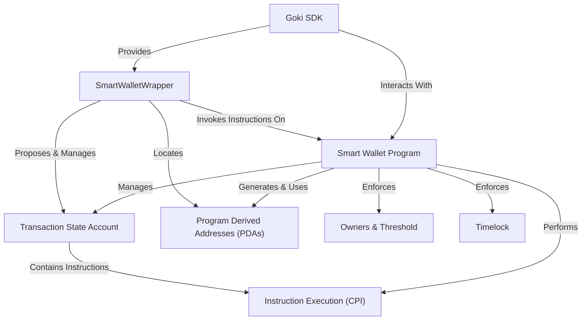

# Tutorial: goki

Goki is a project providing a **multisignature Smart Wallet** on the Solana blockchain. It acts as a secure, shared digital vault, allowing multiple designated *owners* to manage assets collaboratively. Transactions require a *minimum number of approvals (threshold)* and can include an optional *timelock* for added security, ensuring a delay before execution. The project includes a **Smart Wallet Program** (the on-chain contract) and a **Goki SDK** (a TypeScript toolkit) to facilitate easy interaction and management of these secure wallets.

> **Note:** This documentation is deployed to GitHub Pages automatically when changes are pushed to the main branch.

## Visual Overview

## Chapters

1. [SmartWalletWrapper
](01_smartwalletwrapper_.md)
2. [Owners & Threshold
](02_owners___threshold_.md)
3. [Timelock
](03_timelock_.md)
4. [Goki SDK
](04_goki_sdk_.md)
5. [Smart Wallet Program
](05_smart_wallet_program_.md)
6. [Transaction State Account
](06_transaction_state_account_.md)
7. [Instruction Execution (CPI)
](07_instruction_execution__cpi__.md)
8. [Program Derived Addresses (PDAs)
](08_program_derived_addresses__pdas__.md)

---
