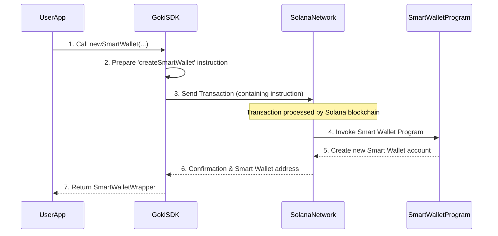

# Goki SDK

Welcome back, Goki explorers! In our previous chapters, we've been using something called `sdk` (like in `sdk.newSmartWallet`) and a `smartWalletWrapper` (our remote control from [Chapter 1: SmartWalletWrapper](smart-wallet-wrapper)). We learned about [Owners & Threshold](owners-threshold) and the safety of [Timelock](timelock).

But what exactly is this `sdk`? This chapter will introduce you to the **Goki SDK**, your central toolkit for building applications that interact with Goki Smart Wallets on Solana.

## The Developer's Toolbox

Imagine you want to build a house. You wouldn't forge your own hammer, saw, and drill from scratch, right? You'd go to a store and buy a pre-made toolbox full of high-quality tools.

The `Goki SDK` is precisely that: a pre-made, easy-to-use **TypeScript toolkit** for developers. It contains all the necessary "tools" (functions and classes) to interact with the Goki Smart Wallet and Token Signer programs on Solana without needing to understand every complex detail of the blockchain.

**What problem does it solve?** Directly talking to a blockchain program (like the Goki Smart Wallet program) can be very complicated. You'd need to know low-level details about data formats, how to build specific instructions, and how to send transactions. The `Goki SDK` takes care of all this complexity for you. It provides simple, user-friendly functions like `newSmartWallet` or `loadSmartWallet` that abstract away the "blockchain jargon."

Our goal in this chapter is to understand how the `Goki SDK` acts as the primary entry point for **managing Goki Smart Wallets** in your applications.

## Key Concepts of the Goki SDK

The Goki SDK is designed to make your life as a developer much easier. Here are its core ideas:

*   **TypeScript Toolkit**: It's written in TypeScript, a popular language for web applications, making it easy to integrate into many projects.
*   **Simplifies Interactions**: It wraps complex blockchain operations into simple function calls.
*   **Abstraction**: It hides the "low-level" details of talking to Solana programs. You focus on *what* you want to do (e.g., "create a new wallet"), not *how* to do it on the blockchain.
*   **User-Friendly Functions**: It provides clear functions for common tasks:
    *   Creating new Goki Smart Wallets.
    *   Loading existing Goki Smart Wallets (and getting their [SmartWalletWrapper](smart-wallet-wrapper)).
    *   Managing derived addresses (we'll cover [Program Derived Addresses (PDAs)](program-derived-addresses-pdas) later!).

Think of the SDK as the "master key" that unlocks all Goki functionalities.

## Using the Goki SDK: Your Starting Point

To use any Goki feature, you first need to get an instance of the `GokiSDK`. This is typically done by "loading" it with a Solana `Provider` (which tells the SDK how to connect to the Solana network and who is signing transactions).

Let's see how you'd get the `sdk` instance, similar to how we've been using it in previous chapters:

```typescript
import * as anchor from "@project-serum/anchor";
import { GokiSDK } from "@gokiprotocol/client"; // This is how you'd import it

// 1. Set up an Anchor Provider (how your app connects to Solana)
const anchorProvider = anchor.AnchorProvider.env();
anchor.setProvider(anchorProvider); // Tells Anchor to use this provider

// 2. Load the Goki SDK
const sdk = GokiSDK.load({
  provider: anchorProvider, // Pass your Solana connection details
});

console.log("Goki SDK loaded and ready!");
```
*Explanation*:
1.  We set up an `AnchorProvider`. This is a common way for Solana applications to connect to the blockchain and specify the wallet that will pay for transaction fees.
2.  We then call `GokiSDK.load()` and pass this `provider`. This function sets up the entire Goki SDK, connecting it to the Goki programs on Solana. The `sdk` variable now holds our powerful toolkit!

### Creating a New Smart Wallet with the SDK

In [Chapter 1: SmartWalletWrapper](smart-wallet-wrapper), we used `sdk.newSmartWallet` to create a new Goki Smart Wallet. This is a perfect example of the SDK's high-level functionality.

```typescript
import { Keypair, PublicKey } from "@solana/web3.js";
import BN from "bn.js";
// ... (previous code for loading sdk)

const ownerA = Keypair.generate();
const owners = [ownerA.publicKey];
const threshold = new BN(1); // 1-of-1 multisig for simplicity
const delaySeconds = new BN(0); // No timelock for this example

// Use the SDK to create a new Smart Wallet
const { smartWalletWrapper, tx } = await sdk.newSmartWallet({
  numOwners: owners.length,
  owners,
  threshold,
  delay: delaySeconds,
});

await tx.confirm(); // Send the transaction to the blockchain
console.log("New Smart Wallet created by SDK:", smartWalletWrapper.key.toBase58());
console.log("Wrapper ready for use!");
```
*Explanation*: The `sdk.newSmartWallet` function takes simple inputs like `owners`, `threshold`, and `delay`. It then handles all the complex steps of preparing the correct blockchain instruction, sending the transaction, and finally returning a `smartWalletWrapper` – our convenient remote control for that newly created wallet.

### Loading an Existing Smart Wallet

If you already have a Smart Wallet and its address (`PublicKey`), you can use the SDK to load its `SmartWalletWrapper`:

```typescript
// ... (previous code for loading sdk)

// Replace with your actual Smart Wallet's public key
const existingSmartWalletAddress = new PublicKey("YourSmartWalletAddressHere");

// Load an existing Smart Wallet using the SDK
const smartWalletWrapper = await sdk.loadSmartWallet(existingSmartWalletAddress);

console.log("Existing Smart Wallet loaded by SDK:", smartWalletWrapper.key.toBase58());
// Now you can use smartWalletWrapper to interact with it!
```
*Explanation*: `sdk.loadSmartWallet` takes the `PublicKey` of an existing Smart Wallet. It then fetches the necessary information from the blockchain and provides you with the `SmartWalletWrapper` instance, allowing you to interact with that specific wallet, just as if you had created it yourself.

## Under the Hood: How the Goki SDK Works

The `Goki SDK` is essentially a smart coordinator. It doesn't *contain* the Goki Smart Wallet or Token Signer programs themselves (those are on the blockchain!), but it knows how to talk to them.

When you call a function on the `Goki SDK`, here's a simplified sequence of what happens:


*Explanation*:
1.  **User action**: Your application calls a function like `newSmartWallet` on the `GokiSDK` instance.
2.  **SDK prepares instruction**: The `GokiSDK` internally uses its knowledge of the Goki [Smart Wallet Program](smart-wallet-program) to construct the correct "instruction" to create a new Smart Wallet. This instruction is a small message telling the blockchain program what to do.
3.  **To the network**: The SDK bundles this instruction into a Solana transaction and sends it to the [Solana Network](https://solana.com/).
4.  **Program invoked**: The Solana Network receives the transaction and routes the instruction to the correct Goki [Smart Wallet Program](smart-wallet-program).
5.  **Program acts**: The [Smart Wallet Program](smart-wallet-program) executes the instruction, creating the new Smart Wallet account on the blockchain.
6.  **Confirmation**: The Solana Network confirms the transaction's success to the `GokiSDK`.
7.  **Result to user**: The `GokiSDK` then wraps the details of the newly created Smart Wallet into a `SmartWalletWrapper` and returns it to your application, ready for use.

## Conclusion

The **Goki SDK** is your essential developer toolkit for building applications on top of the Goki Protocol. It simplifies complex blockchain interactions, providing high-level, user-friendly functions to create, load, and manage Goki Smart Wallets and their transactions. By abstracting away the underlying technical details, the SDK empowers you to integrate secure, shared asset management into your projects with ease.

In the next chapter, we'll finally dive deep into the very heart of the Goki system: the [Smart Wallet Program](smart-wallet-program) itself, understanding what it is and how it functions on the Solana blockchain.
