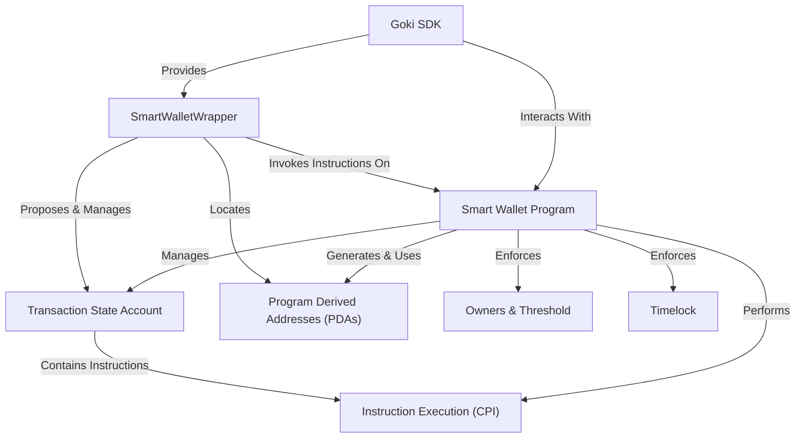

# Introduction to Goki

Goki is a project providing a **multisignature Smart Wallet** on the Solana blockchain. It acts as a secure, shared digital vault, allowing multiple designated *owners* to manage assets collaboratively. Transactions require a *minimum number of approvals (threshold)* and can include an optional *timelock* for added security, ensuring a delay before execution. The project includes a **Smart Wallet Program** (the on-chain contract) and a **Goki SDK** (a TypeScript toolkit) to facilitate easy interaction and management of these secure wallets.

## Visual Overview

## Documentation Chapters

This documentation is organized into the following chapters:

1. [SmartWalletWrapper](smart-wallet-wrapper) - Your personal, easy-to-use remote control for managing Goki Smart Wallets
2. [Owners & Threshold](owners-threshold) - How decision-making works in a multi-signature setup
3. [Timelock](timelock) - Adding time-based security to your transactions
4. [Goki SDK](goki-sdk) - The TypeScript toolkit for interacting with Goki
5. [Smart Wallet Program](smart-wallet-program) - The on-chain contract that powers Goki
6. [Transaction State Account](transaction-state-account) - How transaction data is stored on the blockchain
7. [Instruction Execution (CPI)](instruction-execution-cpi) - How Goki executes instructions on behalf of the wallet
8. [Program Derived Addresses (PDAs)](program-derived-addresses-pdas) - How Goki generates and uses addresses

Each chapter provides detailed explanations, code examples, and diagrams to help you understand how Goki works and how to use it effectively.
