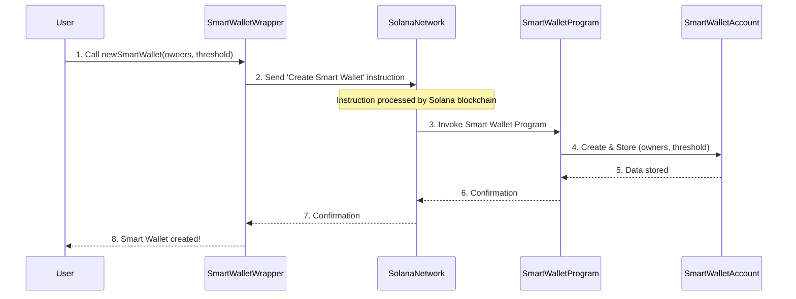

# Owners & Threshold

Welcome back to the Goki journey! In [Chapter 1: SmartWalletWrapper](smart-wallet-wrapper), we learned that the `SmartWalletWrapper` is your "remote control" for Goki Smart Wallets, simplifying how you interact with them. But what exactly is a Goki Smart Wallet made of, and how does it know who can do what?

That's where **Owners & Threshold** come in. These are the foundational security settings of your Goki Smart Wallet, defining its core "multi-signature" (multisig) behavior.

## The Shared Bank Account Dilemma

Imagine you and your friends decided to open a shared bank account for your club. You don't want just *anyone* to be able to spend money. You want rules:
1.  **Who are the authorized people?** (The "owners")
2.  **How many of them need to agree before money can be spent?** (The "threshold")

On the blockchain, a Goki Smart Wallet solves this exact problem for digital assets. It allows multiple digital "keys" (representing individuals or entities) to control a single wallet, and it enforces rules about how many of those keys must "sign off" on a transaction.

## Key Concepts: Owners & Threshold

Let's break down these two essential components:

### 1. Owners

The `owners` are simply a **list of public keys**. Each public key is like a unique digital fingerprint, and it represents someone who has authority over the Smart Wallet. Think of them as the names listed on the shared bank account.

*   **Who they are**: Individuals, organizations, or even other smart contracts.
*   **Their role**: Each owner has the power to propose transactions or approve existing ones.

### 2. Threshold

The `threshold` is a **number** that dictates the minimum number of owners who must agree to a transaction before it can actually happen. It's like the minimum number of signatures required on a check from your shared bank account.

*   **What it does**: Ensures that decisions are not made by a single person, promoting shared governance and security.
*   **Example**: If you have 3 owners and a `threshold` of 2, this is called a "2-of-3" multisig. It means that out of the three owners, any two of them must approve a transaction for it to proceed.

## Setting Up Owners & Threshold in Goki

When you create a new Goki Smart Wallet using the `SmartWalletWrapper`, you define its `owners` and `threshold` right from the start.

Let's revisit the example from Chapter 1, focusing on these parameters:

```typescript
import { Keypair, PublicKey, LAMPORTS_PER_SOL } from "@solana/web3.js";
import { makeSDK } from "./workspace"; // Helper to get the SDK
import BN from "bn.js";

const sdk = makeSDK(); // Our entry point to Goki

// 1. Define our Owners
const ownerA = Keypair.generate();
const ownerB = Keypair.generate();
const ownerC = Keypair.generate();
const owners = [ownerA.publicKey, ownerB.publicKey, ownerC.publicKey]; // A list of 3 owner public keys

// 2. Define our Threshold
const threshold = new BN(2); // Requires 2 approvals out of these 3 owners

let smartWalletWrapper; // This will hold our remote control!

// Create a new Smart Wallet using these owners and threshold
const { smartWalletWrapper: wrapperInner, tx } = await sdk.newSmartWallet({
  numOwners: owners.length, // Total number of owners
  owners,                    // The list of owner public keys
  threshold,                 // The minimum number of approvals needed
});
await tx.confirm(); // Send the transaction to create the wallet
smartWalletWrapper = wrapperInner;
console.log("Smart Wallet created:", smartWalletWrapper.key.toBase58());
```
*Explanation*: In this code, we first create three unique digital keys (`ownerA`, `ownerB`, `ownerC`) to represent our owners. We then list their public keys in the `owners` array. Crucially, we set the `threshold` to `2`. This means our Smart Wallet is now configured as a "2-of-3" multisig: any transaction will need approvals from at least two of `ownerA`, `ownerB`, or `ownerC` to be executed.

## Owners & Threshold in Action

Let's see how these settings play out when we actually use the wallet to send some SOL, just like we did in Chapter 1.

### 1. Proposing a Transaction

Any owner can propose a transaction. Let's say `ownerA` proposes sending `0.1 SOL`.

```typescript
import { SystemProgram } from "@solana/web3.js";
// ... (previous code for smartWalletWrapper)

const recipient = Keypair.generate().publicKey;
const amountToSend = 0.1 * LAMPORTS_PER_SOL;

// Owner A proposes the transaction
const transferInstruction = SystemProgram.transfer({
  fromPubkey: smartWalletWrapper.key,
  toPubkey: recipient,
  lamports: amountToSend,
});

const { transactionKey, tx: proposeTx } =
  await smartWalletWrapper.newTransaction({
    proposer: ownerA.publicKey, // Owner A is the proposer
    instructions: [transferInstruction],
  });
proposeTx.signers.push(ownerA);
await proposeTx.confirm();
console.log("Transaction proposed:", transactionKey.toBase58());
```
*Explanation*: Even though `ownerA` proposed the transaction, the `threshold` of 2 has *not* been met yet. The transaction is just a "proposal" at this stage.

### 2. Approving a Transaction

Now, another owner needs to approve the transaction. Let's have `ownerB` approve it.

```typescript
// ... (previous code for transactionKey)

// Owner B approves the transaction
await smartWalletWrapper
  .approveTransaction(transactionKey, ownerB.publicKey)
  .addSigners(ownerB)
  .confirm();
console.log("Transaction approved by Owner B.");

// Check the current state of the transaction
const txState = await smartWalletWrapper.fetchTransaction(transactionKey);
console.log("Approvals needed:", txState.numApprovalsNeeded.toNumber()); // This will be 2
console.log("Approvals received:", txState.numApprovals.toNumber());     // This will be 2
```
*Explanation*: After `ownerB` approves, the Smart Wallet now has 2 approvals (from `ownerA` and `ownerB`). Since our `threshold` was set to 2, the transaction has now met the required number of approvals! It's ready to be executed.

### 3. Executing a Transaction

Once the threshold is met, any owner (or even someone else, if the transaction is public) can execute it. Let's have `ownerC` execute it.

```typescript
// ... (previous code for transactionKey)

// Owner C executes the transaction
await smartWalletWrapper
  .executeTransaction({
    transactionKey,
    owner: ownerC.publicKey,
  })
  .addSigners(ownerC)
  .confirm();
console.log("Transaction executed successfully!");
// The 0.1 SOL has now been sent!
```
*Explanation*: When `ownerC` attempts to execute, the [Smart Wallet Program](smart-wallet-program) (which we'll explore next) checks if the `threshold` of approvals has been met. Since it has (2 approvals for a threshold of 2), the transaction is allowed to proceed and the SOL is sent.

## Under the Hood: How Owners & Threshold Work

The `owners` list and `threshold` value are not just temporary settings; they are fundamental data stored directly on the blockchain as part of your `SmartWallet` account.

### Where the Data Lives

When you use `sdk.newSmartWallet`, the [Smart Wallet Program](smart-wallet-program) creates a special account on the Solana blockchain for your Smart Wallet. This account permanently stores your `owners` list and `threshold` number.


*Explanation*: When you create the Smart Wallet, the `SmartWalletProgram` receives the list of `owners` and the `threshold`. It then securely saves this information into the `SmartWalletAccount` on the blockchain. This data is now the official record for your wallet's security rules.

### How the Program Uses Them

The real power of `owners` and `threshold` comes from how the [Smart Wallet Program](smart-wallet-program) uses them to *enforce* the rules.

*   **During `approveTransaction`**: When an owner approves a transaction, the program checks if the signer is indeed one of the `owners` listed in the `SmartWallet` account. If not, the approval fails.
*   **During `executeTransaction`**: Before executing any instruction, the program checks the current number of approvals on the proposed transaction against the `threshold` stored in the `SmartWallet` account. If `approvals < threshold`, the execution is rejected.

This is a crucial security feature: the rules are enforced by the blockchain program itself, not just by your local `SmartWalletWrapper`.

Let's look at a simplified code snippet from the core [Smart Wallet Program](smart-wallet-program) written in Rust (`programs/smart-wallet/src/lib.rs` and `programs/smart-wallet/src/state.rs`) to see where these values are stored and referenced:

```rust
// Simplified from programs/smart-wallet/src/state.rs

/// A [SmartWallet] is a multisig wallet with Timelock capabilities.
#[account]
#[derive(Default, Debug, PartialEq)]
pub struct SmartWallet {
    // ... other fields ...

    /// Minimum number of owner approvals needed to sign a [Transaction].
    pub threshold: u64,

    /// Owners of the [SmartWallet].
    pub owners: Vec<Pubkey>,

    // ... other fields ...
}

impl SmartWallet {
    /// Gets the index of the key in the owners Vec, or error
    pub fn try_owner_index(&self, key: Pubkey) -> Result<usize> {
        // This function checks if a given public key is one of the owners.
        // It returns an error if the key is not found in the 'owners' list.
        Ok(unwrap_opt!(self.owner_index_opt(key), InvalidOwner))
    }
}
```
*Explanation*: The `SmartWallet` struct is how your Smart Wallet's data is organized on the blockchain. Notice it has `threshold` and `owners` fields. The `try_owner_index` function is an example of how the program can check if a given public key (e.g., the one trying to approve a transaction) is actually one of the authorized `owners`.

And here's a peek at how they are set when the Smart Wallet is created:

```rust
// Simplified from programs/smart-wallet/src/lib.rs

#[program]
pub mod smart_wallet {
    use super::*;

    /// Initializes a new [SmartWallet] account.
    pub fn create_smart_wallet(
        ctx: Context<CreateSmartWallet>,
        _bump: u8,
        max_owners: u8, // Max number of owners this wallet can ever have
        owners: Vec<Pubkey>, // The actual list of owners
        threshold: u64,      // The required approval count
        minimum_delay: i64,
    ) -> Result<()> {
        let smart_wallet = &mut ctx.accounts.smart_wallet;

        smart_wallet.threshold = threshold; // Program stores the threshold
        smart_wallet.owners = owners.clone(); // Program stores the owners list

        // ... other initialization ...
        Ok(())
    }
}
```
*Explanation*: In the `create_smart_wallet` function, you can see how the `threshold` and `owners` values passed during creation are directly saved into the `smart_wallet` account on the blockchain. From this point forward, these values define the security parameters of your Goki Smart Wallet.

## Conclusion

**Owners & Threshold** are the bedrock of security and control for your Goki Smart Wallet. They define who has authority and how many agreements are needed for any action. By understanding these concepts, you grasp how shared control is enforced on the blockchain, making Goki ideal for managing collective assets.

In the next chapter, we'll delve into [Timelock](timelock), another powerful security feature that adds a time-based delay to transactions, providing an extra layer of safety.

---
<sub><sup>**References**: [Smart Wallet Program](https://github.com/GokiProtocol/goki/blob/87aff0569301acd16f3bdcbfec09cae6ba3e62cc/programs/smart-wallet/src/lib.rs), [Smart Wallet State](https://github.com/GokiProtocol/goki/blob/87aff0569301acd16f3bdcbfec09cae6ba3e62cc/programs/smart-wallet/src/state.rs), [SDK](https://github.com/GokiProtocol/goki/blob/87aff0569301acd16f3bdcbfec09cae6ba3e62cc/src/sdk.ts), [Tests](https://github.com/GokiProtocol/goki/blob/87aff0569301acd16f3bdcbfec09cae6ba3e62cc/tests/smartWallet.spec.ts)</sup></sub>
