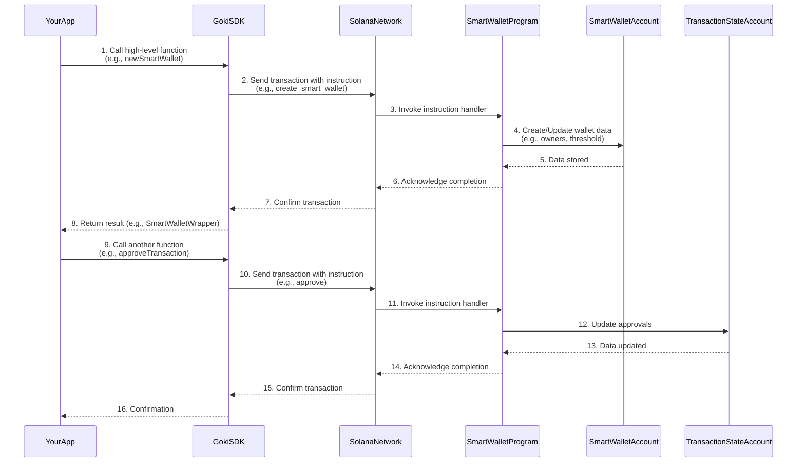

# Smart Wallet Program

Welcome back, Goki explorers! In our previous chapters, we've explored the [Goki SDK](goki-sdk) as your toolkit and the [SmartWalletWrapper](smart-wallet-wrapper) as your remote control for Goki Smart Wallets. We also learned about the crucial rules of [Owners & Threshold](owners-threshold) and the added safety of [Timelock](timelock).

But all these amazing features, rules, and controls don't just happen by magic. They are enforced by a powerful piece of code that lives permanently on the Solana blockchain: the **Smart Wallet Program**.

## The Brain of the Goki System

Imagine your Smart Wallet is a high-tech vault for your digital assets. The [SmartWalletWrapper](smart-wallet-wrapper) is the keypad and screen on the vault door, and the [Goki SDK](goki-sdk) is the engineering manual for the keypad. But the **Smart Wallet Program** is the actual *computer brain* inside the vault that processes every command, checks all the rules, and ensures everything is secure.

This program is the **core smart contract** residing directly on the Solana blockchain. It defines the complete logic and rules for how a Goki Smart Wallet operates. When you use the [Goki SDK](goki-sdk) or [SmartWalletWrapper](smart-wallet-wrapper) to propose, approve, or execute a transaction, you're ultimately sending instructions to this Smart Wallet Program.

**What problem does it solve?** It provides a decentralized, transparent, and unchangeable set of rules for managing shared digital assets. Because it lives on the blockchain, everyone can see its code, and once deployed, its rules cannot be changed without another multi-signature process, providing maximum security and trust.

## Key Concepts: What is a Program on Solana?

Before diving deeper, let's quickly clarify what a "program" means in the context of Solana:

*   **Like an App on a Smartphone**: Think of a program on Solana as an application or software that runs directly on the blockchain. Just as an app has specific functions (like "send message" or "take photo"), a Solana program has specific instructions it can execute (like "create a Smart Wallet" or "execute a transaction").
*   **Written in Rust**: Most Solana programs, including Goki's Smart Wallet Program, are written in a programming language called Rust.
*   **Immutable and Public**: Once a program is deployed to the Solana blockchain, its code is generally unchangeable and publicly visible. This transparency is a key security feature, as anyone can verify its logic.
*   **Manages Accounts**: Programs interact with "accounts" on the blockchain. Accounts are like files or storage locations where data is kept. The Smart Wallet Program manages two main types of accounts:
    *   The `SmartWallet` account: Stores the wallet's main configuration (like [Owners & Threshold](owners-threshold) and [Timelock](timelock) settings).
    *   The [Transaction State Account](transaction-state-account): Stores the details of a specific proposed transaction, including its approvals.

### The Program's Role in Goki

The Smart Wallet Program is responsible for:

| Feature                   | Program's Role                                                                                                                                                                                          |
| :------------------------ | :------------------------------------------------------------------------------------------------------------------------------------------------------------------------------------------------------ |
| **Wallet Creation**       | It creates the `SmartWallet` account, storing the initial [Owners & Threshold](owners-threshold) list, and the [Timelock](timelock) `minimum_delay`.                                      |
| **Transaction Proposal**  | It creates a [Transaction State Account](transaction-state-account) for each proposed action, recording the proposed instructions and the `eta` ([Timelock](timelock)).                  |
| **Approval Enforcement**  | When an `owner` approves, it checks if the owner is valid and updates the `signers` list within the [Transaction State Account](transaction-state-account).                                       |
| **Threshold Check**       | Before execution, it verifies that the `num_signers` on a transaction meets or exceeds the `threshold` set in the `SmartWallet` account.                                                                 |
| **Timelock Enforcement**  | Before execution, it checks if the current time has passed the `eta` set for the transaction. If not, it prevents execution.                                                                            |
| **Instruction Execution** | Once all conditions (threshold, timelock) are met, it directly executes the instructions stored within the [Transaction State Account](transaction-state-account) on behalf of the Smart Wallet. |

## How the Smart Wallet Program Works with Your Commands

As a developer using Goki, you don't directly write Rust code to interact with the Smart Wallet Program. Instead, you use the convenient functions provided by the [Goki SDK](goki-sdk) and the [SmartWalletWrapper](smart-wallet-wrapper). These tools then construct the proper messages (called "instructions") and send them to the Smart Wallet Program on the Solana blockchain.

Let's revisit our example of creating a Smart Wallet and executing a transaction, but this time, focusing on the Smart Wallet Program's perspective:

### 1. Creating a Smart Wallet

When you call `sdk.newSmartWallet`, the [Goki SDK](goki-sdk) sends an instruction to the Smart Wallet Program.

```typescript
// From Chapter 4: Goki SDK
// ...
const { smartWalletWrapper, tx } = await sdk.newSmartWallet({
  numOwners: owners.length,
  owners,
  threshold,
  delay: delaySeconds, // The program will store this
});
await tx.confirm();
console.log("New Smart Wallet created by SDK:", smartWalletWrapper.key.toBase58());
```
*Program's Action*: The Smart Wallet Program receives this instruction. It then creates a new `SmartWallet` account on the blockchain, storing the `owners` list, the `threshold`, and the `delay` (minimum timelock) inside this account. This defines the fundamental security rules for your new Smart Wallet.

### 2. Proposing a Transaction

When you call `smartWalletWrapper.newTransaction`, the [SmartWalletWrapper](smart-wallet-wrapper) sends another instruction to the Smart Wallet Program.

```typescript
// From Chapter 1: SmartWalletWrapper
// ...
const { transactionKey, tx: proposeTx } =
  await smartWalletWrapper.newTransaction({
    proposer: ownerA.publicKey,
    instructions: [transferInstruction],
    eta, // The program will store this
  });
proposeTx.signers.push(ownerA);
await proposeTx.confirm();
console.log("Transaction proposed:", transactionKey.toBase58());
```
*Program's Action*: The Smart Wallet Program receives the proposal. It creates a new [Transaction State Account](transaction-state-account) to hold the details of this pending transaction. It records the proposed `instructions`, the `proposer`, and the `eta` ([Timelock](timelock)) for this specific transaction. It also marks `ownerA` as having approved it.

### 3. Approving a Transaction

When `smartWalletWrapper.approveTransaction` is called by another owner:

```typescript
// From Chapter 1: SmartWalletWrapper
// ...
await smartWalletWrapper
  .approveTransaction(transactionKey, ownerB.publicKey)
  .addSigners(ownerB)
  .confirm();
console.log("Transaction approved by Owner B.");
```
*Program's Action*: The Smart Wallet Program checks if `ownerB` is indeed one of the authorized [Owners](owners-threshold) of this Smart Wallet. If yes, it updates the `signers` list within the [Transaction State Account](transaction-state-account) to reflect `ownerB`'s approval. It now checks if the number of `signers` meets the `threshold` for the Smart Wallet.

### 4. Executing a Transaction

When `smartWalletWrapper.executeTransaction` is called:

```typescript
// From Chapter 1: SmartWalletWrapper
// ...
await smartWalletWrapper
  .executeTransaction({
    transactionKey,
    owner: ownerC.publicKey,
  })
  .addSigners(ownerC)
  .confirm();
console.log("Transaction executed successfully!");
```
*Program's Action*: This is where the Smart Wallet Program performs its most critical checks:
1.  **Threshold Check**: It first checks the [Transaction State Account](transaction-state-account) to see if `num_signers` (total approvals) is greater than or equal to the `threshold` stored in the `SmartWallet` account. If not, it stops.
2.  **Timelock Check**: It checks if the current time on the blockchain has passed the `eta` stored in the [Transaction State Account](transaction-state-account). If the `eta` is in the future, it stops.
3.  **Execution**: If both checks pass, the Smart Wallet Program then takes the `instructions` from the [Transaction State Account](transaction-state-account) and executes them directly on the Solana blockchain. This is when the SOL is actually sent, or other actions occur. It then marks the transaction as "executed" to prevent it from being run again.

## Under the Hood: The Program in Action

The Smart Wallet Program (`programs/smart-wallet/src/lib.rs`) is the central piece of logic that makes Goki work. All the high-level commands from the [Goki SDK](goki-sdk) translate into specific *instructions* that the program processes.

Here's a simplified view of how your commands flow to the Smart Wallet Program:


*Explanation*: Each action you take through the [Goki SDK](goki-sdk) eventually gets turned into a specific instruction for the `SmartWalletProgram`. The program then reads or writes data to the relevant accounts (`SmartWalletAccount` or [Transaction State Account](transaction-state-account)) on the blockchain, enforcing all the rules we've discussed.

## Conclusion

The **Smart Wallet Program** is the secure, rule-enforcing engine that powers every Goki Smart Wallet. It's the central smart contract on the Solana blockchain that guarantees the multi-signature and timelock rules are always followed. While you interact with it through the user-friendly [Goki SDK](goki-sdk) and [SmartWalletWrapper](smart-wallet-wrapper), understanding its role as the on-chain "brain" is key to appreciating the robust security Goki offers.

In the next chapter, we'll delve deeper into the [Transaction State Account](transaction-state-account), the specific place on the blockchain where the Smart Wallet Program stores all the information about your proposed and ongoing multi-signature transactions.
