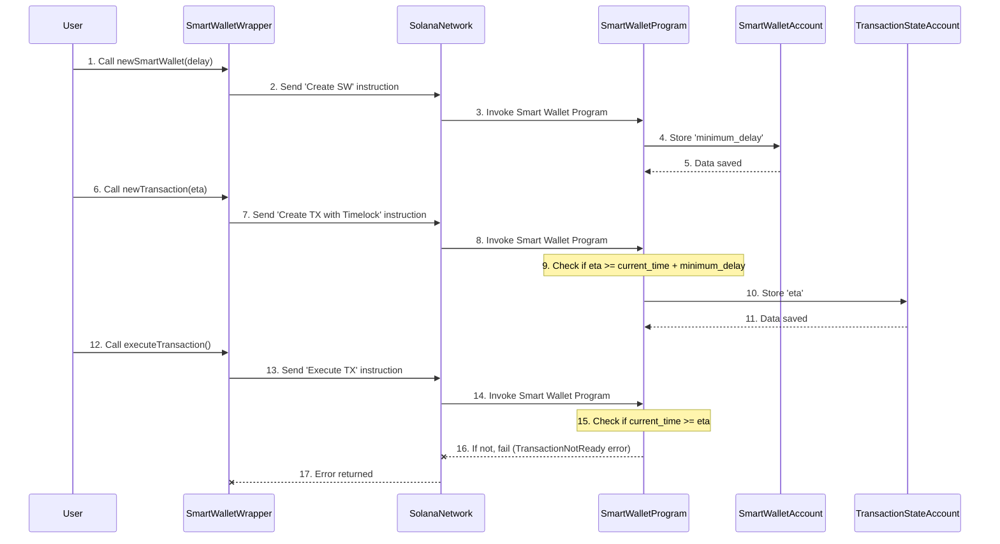

# Timelock

Welcome back to Goki! In the previous chapter, [Owners & Threshold](owners-threshold), we learned how your Goki Smart Wallet sets up shared control: who can make decisions (owners) and how many need to agree (threshold). These are powerful for security, but what if a decision is approved that turns out to be a mistake or even malicious?

This is where **Timelock** comes in. It's an extra layer of security that acts like a mandatory "cooling-off" period.

## The Bank Account Safety Net

Let's go back to our shared bank account analogy. Imagine you and your friends approve a large payment. But just after everyone agrees, you realize someone made a typo in the amount, or even worse, that the payment address is wrong!

Without a safety net, that money would be sent instantly. But what if the bank had a rule: "Any payment over $1,000 must wait 24 hours before it's processed"? That 24-hour window gives you crucial time to detect the error and cancel the payment.

On the Solana blockchain, `Timelock` provides this exact safety net for your Goki Smart Wallet. It's a delay between when a transaction is approved by the required number of [Owners & Threshold](owners-threshold) and when it can actually be executed on the blockchain.

## Key Concepts: Timelock

`Timelock` introduces two important values:

1.  **Minimum Delay**: This is a setting for the *entire* Smart Wallet. It's the shortest amount of time (in seconds) that *any* transaction must wait after being approved, before it can be executed. Think of it as a base security policy for your wallet.

2.  **Estimated Time of Arrival (ETA)**: This is a specific time (a timestamp in seconds) set for *each individual transaction*. When you propose a transaction, you can specify its `ETA`. The `ETA` must be at least the current time plus the Smart Wallet's `minimumDelay`. A transaction cannot be executed until its `ETA` has passed.

Why both? The `minimumDelay` ensures that even if you forget to set an `ETA` for a specific transaction, there's always a baseline delay for the entire wallet. The `ETA` gives you flexibility to set longer delays for particularly sensitive operations.

## Using Timelock in Goki

Let's see how we can add this crucial safety feature when creating our Smart Wallet and when proposing transactions.

### 1. Setting the Smart Wallet's Minimum Delay

You define the `minimumDelay` when you first create your Goki Smart Wallet. This sets a default waiting period for all future transactions.

```typescript
import { Keypair, PublicKey, LAMPORTS_PER_SOL } from "@solana/web3.js";
import { makeSDK } from "./workspace";
import BN from "bn.js";

const sdk = makeSDK();
const ownerA = Keypair.generate();
const owners = [ownerA.publicKey];
const threshold = new BN(1); // 1-of-1 multisig for simplicity

const fiveSeconds = new BN(5); // Our minimum delay: 5 seconds

let smartWalletWrapper;

// Create a new Smart Wallet with a minimum delay
const { smartWalletWrapper: wrapperInner, tx } = await sdk.newSmartWallet({
  numOwners: owners.length,
  owners,
  threshold,
  delay: fiveSeconds, // <-- Here's the new 'delay' parameter!
});
await tx.confirm();
smartWalletWrapper = wrapperInner;
console.log("Smart Wallet created with 5s delay:", smartWalletWrapper.key.toBase58());
```
*Explanation*: We've added a `delay` parameter to `sdk.newSmartWallet`. This tells the Goki program that any transaction for this `smartWalletWrapper` will have a minimum waiting period of 5 seconds after approval.

### 2. Proposing a Transaction with an ETA

When you propose a new transaction, you can specify an `eta` (Estimated Time of Arrival). This `eta` must be at least the current time plus the `minimumDelay` you set for the wallet.

```typescript
import { SystemProgram } from "@solana/web3.js";
// ... (previous code for smartWalletWrapper)
import { sleep } from "@saberhq/token-utils"; // Need this for delay

const recipient = Keypair.generate().publicKey;
const amountToSend = 0.01 * LAMPORTS_PER_SOL;

// Calculate ETA: Current time + Smart Wallet's minimum delay + some buffer
const smartWalletData = await smartWalletWrapper.reloadData(); // Get current data
const minDelay = smartWalletData.minimumDelay.toNumber();
const eta = new BN(Date.now() / 1000 + minDelay + 1); // Add 1 second buffer

const transferInstruction = SystemProgram.transfer({
  fromPubkey: smartWalletWrapper.key,
  toPubkey: recipient,
  lamports: amountToSend,
});

const { transactionKey, tx: proposeTx } =
  await smartWalletWrapper.newTransaction({
    proposer: ownerA.publicKey,
    instructions: [transferInstruction],
    eta, // <-- Here we set the ETA!
  });
proposeTx.signers.push(ownerA);
await proposeTx.confirm();
console.log("Transaction proposed with ETA:", transactionKey.toBase58());
```
*Explanation*: We calculate `eta` by taking the current time, adding the Smart Wallet's `minimumDelay` (which is 5 seconds in our example), and a small buffer. This ensures the `eta` is valid. We then pass this `eta` when proposing the transaction. Since our threshold is 1-of-1, `ownerA` proposing also means it's approved.

### 3. Attempting to Execute Before Timelock Expires

Now, let's try to execute this transaction immediately. Since we have a `minimumDelay` and an `eta`, it should fail if the `eta` hasn't passed yet.

```typescript
// ... (previous code for transactionKey)

// Try to execute immediately
try {
  await smartWalletWrapper
    .executeTransaction({
      transactionKey,
      owner: ownerA.publicKey,
    })
    .addSigners(ownerA)
    .confirm();
  console.log("This should not be printed!");
} catch (e) {
  // We expect this to fail because the timelock hasn't passed
  console.log("Failed to execute (as expected):", (e as Error).message);
}
```
*Explanation*: When `executeTransaction` is called, the Goki Smart Wallet program checks if the `eta` for this specific transaction has passed. Since we're trying to execute it immediately, it will likely fail with a "Transaction Not Ready" error.

### 4. Executing After Timelock Expires

To successfully execute, we need to wait until the `eta` has passed.

```typescript
// ... (previous code for transactionKey, eta)

// Wait until the ETA has passed
const timeToWait = eta.toNumber() - (Date.now() / 1000) + 1; // Add 1 sec buffer
console.log(`Waiting for ${timeToWait.toFixed(0)} seconds for Timelock...`);
await sleep(timeToWait * 1000); // Sleep function from @saberhq/token-utils

// Now, execute the transaction
await smartWalletWrapper
  .executeTransaction({
    transactionKey,
    owner: ownerA.publicKey,
  })
  .addSigners(ownerA)
  .confirm();
console.log("Transaction executed successfully after Timelock!");
// The 0.01 SOL has now been sent!
```
*Explanation*: We use a `sleep` function to pause our program until the `eta` is definitely in the past. After waiting, when `executeTransaction` is called again, the Goki program will see that the `eta` condition is met, and the transaction will proceed successfully.

## Under the Hood: How Timelock Works

Timelock is enforced directly by the [Smart Wallet Program](smart-wallet-program) on the blockchain. Here's a simplified look at what happens:


*Explanation*:
1.  **Wallet Creation**: When you create a Smart Wallet with a `delay`, the `SmartWalletWrapper` tells the [Smart Wallet Program](smart-wallet-program) to store this `minimum_delay` value directly in your `SmartWallet`'s data on the blockchain ([SmartWalletAccount](smart-wallet-program)).
2.  **Transaction Proposal**: When you propose a transaction with an `eta`, the `SmartWalletWrapper` sends a `create_transaction_with_timelock` instruction to the [Smart Wallet Program](smart-wallet-program). The program first verifies that the `eta` you provided is valid (meaning it's in the future and meets the `minimum_delay` requirement). If valid, it stores this `eta` in the new [Transaction State Account](transaction-state-account).
3.  **Transaction Execution**: When anyone tries to `executeTransaction`, the [Smart Wallet Program](smart-wallet-program) checks the `eta` stored in the [Transaction State Account](transaction-state-account). If the current time on the blockchain (provided by the `Clock` sysvar) is *before* the `eta`, the program stops the execution and returns an error (`TransactionNotReady`). Only once the `eta` has passed will the program allow the transaction to proceed.

## Conclusion

**Timelock** adds a powerful time-based security layer to your Goki Smart Wallet. By introducing a minimum delay between approval and execution, it provides a crucial window to detect and prevent errors or malicious activities, significantly enhancing the safety of your digital assets. This feature is especially valuable for high-value operations where even a small mistake could have large consequences.

In the next chapter, we'll shift our focus to the [Goki SDK](goki-sdk) itself, understanding how it provides the tools and functions to easily interact with all these Smart Wallet features from your applications.
